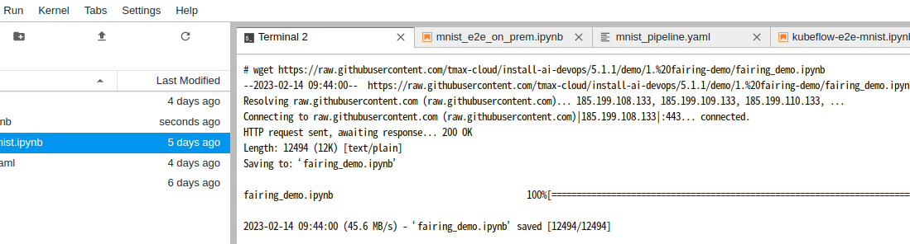
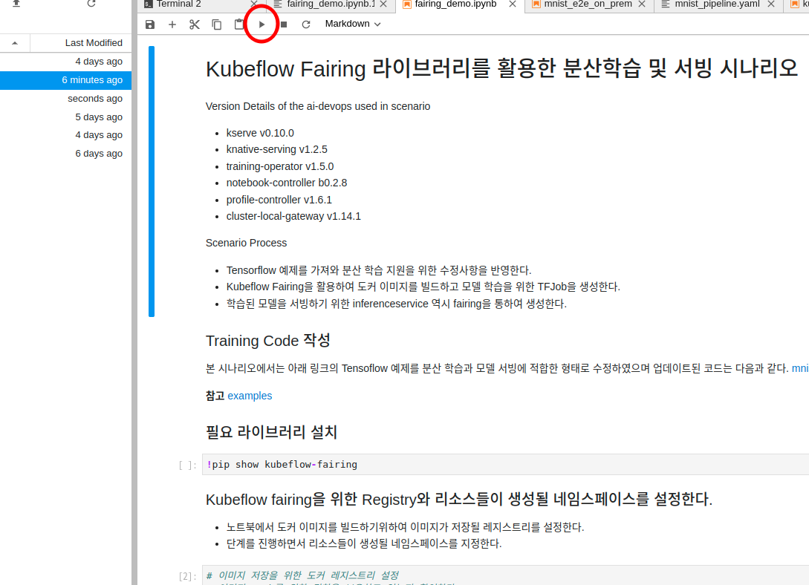

## Kubeflow Fairing 라이브러리를 활용한 분산학습 및 서빙 시나리오

Version Details of the ai-devops used in scenario
- kserve v0.8.0
- knative-serving v1.2.5
- training-operator v1.5.0
- notebook-controller b0.2.8
- profile-controller v1.6.1
- cluster-local-gateway v1.14.1

Scenario Process
- Tensorflow 예제를 가져와 분산 학습 지원을 위한 수정사항을 반영한다.
- Kubeflow Fairing을 활용하여 도커 이미지를 빌드하고 모델 학습을 위한 TFJob을 생성한다.
- 학습된 모델을 서빙하기 위한 inferenceservice 역시 fairing을 통하여 생성한다. 
  * 순서 
    1. 노트북 서버에 접속후 새로운 terminal을 열고 필요 파일들을 다운로드한다.
  
  
    2. 순서에 따라 code run을 진행한다.
  