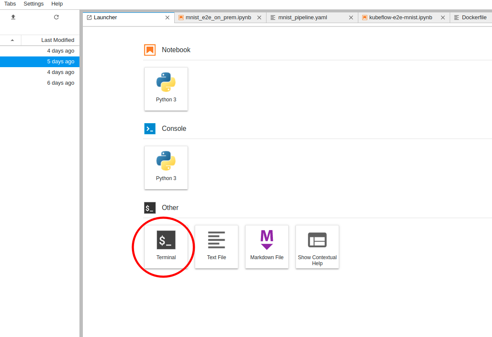
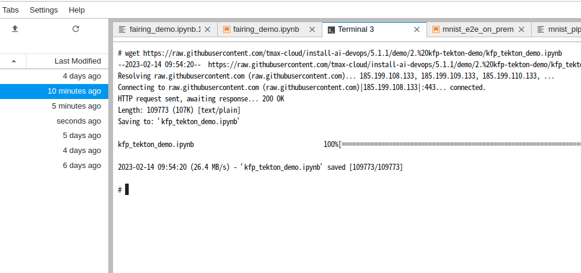
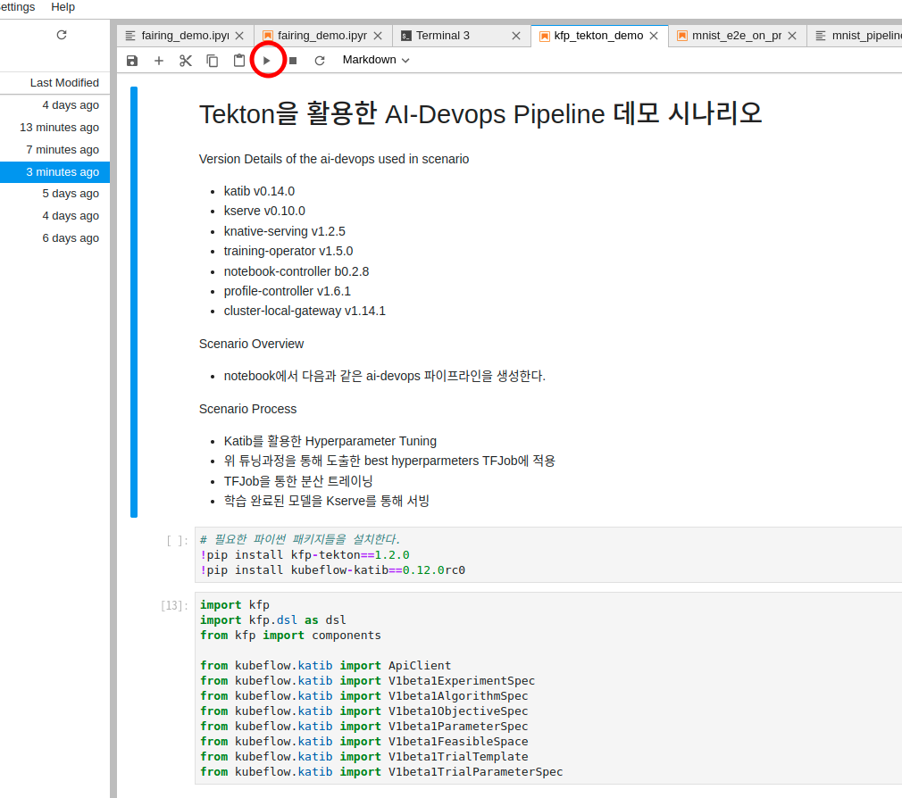
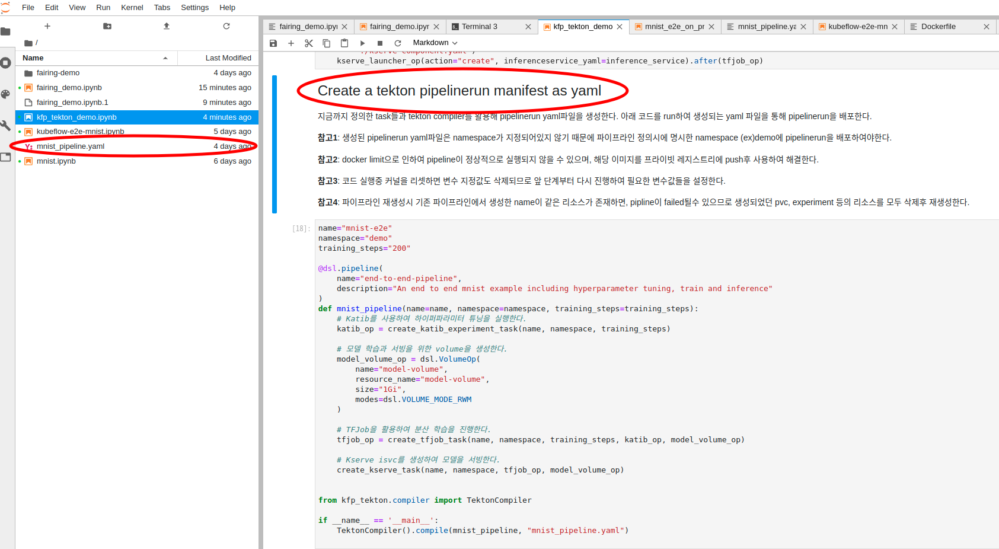

## Tekton을 활용한 AI-Devops Pipeline 데모 시나리오

Version Details of the ai-devops used in scenario
- katib v0.14.0
- kserve v0.8.0
- knative-serving v1.2.5
- training-operator v1.5.0
- notebook-controller b0.2.8
- profile-controller v1.6.1
- cluster-local-gateway v1.14.1

Scenario Overview
- notebook에서 다음과 같은 ai-devops 파이프라인을 생성한다.

Scenario Process
- Katib를 활용한 Hyperparameter Tuning 
- 위 튜닝과정을 통해 도출한 best hyperparmeters TFJob에 적용
- TFJob을 통한 분산 트레이닝
- 학습 완료된 모델을 Kserve를 통해 서빙
  * 순서 
    1. 노트북 서버에 접속후 새로운 terminal을 열고 필요 파일들을 다운로드한다.
  
  
    2. 순서에 따라 code run을 진행한다.
  
    3. 아래 이미지의 단계까지 성공적으로 완료되면 노트북 화면에서 다음과 같이 mnist_pipeline.yaml파일을 확인할수 있다.
  
    4. 위 단계의 yaml파일을 통해 클러스터에 tekton pipelinerun 리소스를 배포한다.
    **참고**: 생성된 pipelinerun yaml파일은 namespace가 지정되어있지 않기 때문에 파이프라인 정의시에 명시한 namespace (ex)demo에 pipelinerun을 배포하여야한다.