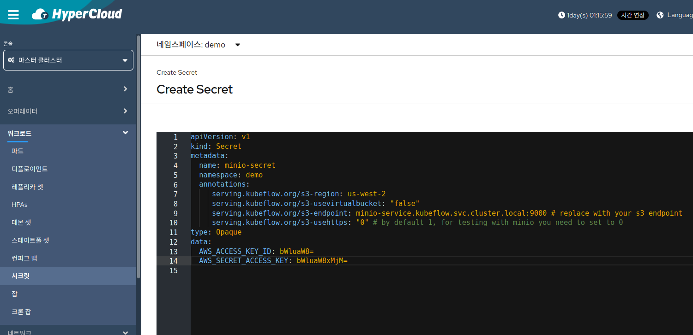
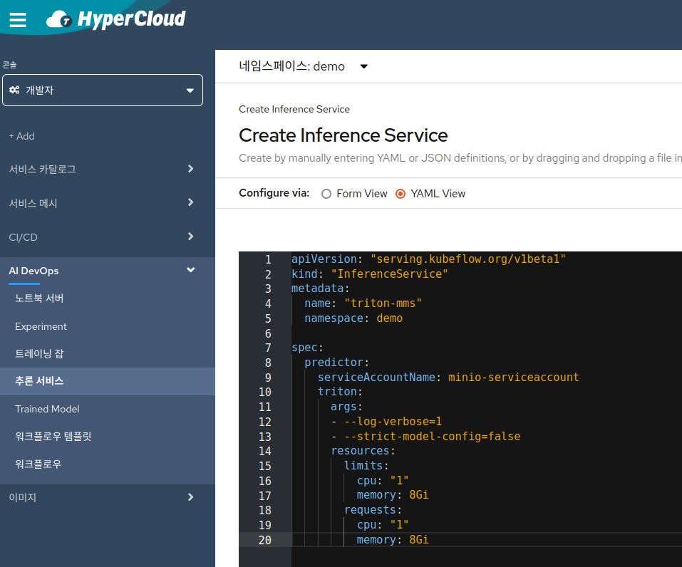

## Kserve를 활용한 multi model serving 시나리오

  * 목적 : `하나의 ml 서버에서 여러 모델들을 추론할 수 있는 multi-model ml service를 생성한다.`
  참고 사항 : 
   - kserve 0.8 version 기준 multi-model inferenceservice agent에서 pvc를 지원하지 않아 minio storage server 사용
   - 참고: 지원 프로토콜로는 s3, gs ,https, http가 있다.
   - 본 시나리오에서는 Tensorflow의 savedmodel 방식 사용
  * 순서 
    1. 이전에 생성한 notebook server를 이용, [mms-fashion.ipynb](mms-fashion.ipynb)와 [mms-mnist.ipynb](mms-mnist.ipynb)를 참고하여 model code 작성 후 학습 진행
  
    2. InferenceService에서 모델 로딩을 위한 minio 관련 설정 셋팅
      - 'MINIO_ACCESS_KEY'와 'MINIO_SECRET_KEY' 확인(BASE64)
      - minio s3 endpoint 접근 설정
       
   
  참고 : [7.s3_secret.yaml](./7.s3_secret.yaml)    
   
  참고 : [7.service-account.yaml](./7.service-account.yaml)    
    3. InferenceService 생성
      - multi-model serving을 위한 inference server 생성
      - 기존의 inferenceservice와 달리 storageuri 제거 및 s3 endpoint 연동
      - READY가 True 상태라면 정상동작 하는 것이고 생성시 5분가량 시간이 소요될 수 있다. 
   
  참고 : [7.inferenceservice.yaml](./7.inferenceservice.yaml)        
    4. minio storage server에 업로드
   - minio-client 이용 checkpoint upload
   - Notebook에서 terminal을 열고 아래 명령어를 통해 minio client 설치      
```bash
wget https://dl.min.io/client/mc/release/linux-amd64/mc
chmod +x mc
```
   - minio pod IP와 port 확인       
       
       
   - minio client를 다운로드 받은 터미널 경로에서 확인한 IP, port를 사용하여 minio server 접근(access key와 secret key는 이전 단계에서 확인 했던 것을 사용)        
```bash
./mc config host add myminio http://${MINIO_IP}:${MINIO_PORT} ${MINIO_ACCESS_KEY} ${MINIO_SECRET_KRY}
```
   - 해당 minio server에서 bucket을 만들고 checkpoint 업로드 후 정상 업로드 확인

```bash
# bucket 생성
./mc mb myminio/triton
# 업로드
./mc cp -r models/ myminio/triton/models
# 정상 업로드 확인
./mc tree myminio/
```
      
   5. trainedmodel 생성
  
  참고 : [7.fashion.yaml](7.fashion.yaml) 
          [7.mnist.yaml](7.mnist.yaml) 
   - 학습한 model들을 이용한 inference test 
    - InferenceService로 request를 위한 환경 변수 설정 (master node에서 진행)

```bash
# INGRESS에서 인식할 수 있도록 SERVICE_HOSTNAME 설정
SERVICE_HOSTNAME=$(kubectl get inferenceservices triton-mms -o jsonpath='{.status.url}' -n mms | cut -d "/" -f 3)
CLUSTER_IP=$(kubectl -n istio-system get service ingressgateway -o jsonpath='{.status.loadBalancer.ingress[0].ip}')
```

   - Request가 정상적으로 가는지 확인
     - 정상적으로 가지 않거나 다음과 같이 서버의 metadata가 나오지 않는다면 InferenceService pod의 `ClusterIP` 또는  service를 통해서 expose해서 해당 url을 사용해야함 (endpoint는 동일)

```bash
curl -v -H "Host: ${SERVICE_HOSTNAME}" http://${CLUSTER_IP}/v2

{"name":"triton","version":"2.2.0","extensions":["classification","sequence","model_repository","schedule_policy","model_configuration","system_shared_memory","cuda_shared_memory","binary_tensor_data","statistics"]}
```


   - 모델 endpoint로 inference 요청

```bash
MODEL_NAME=mnist
curl -v -X POST -H "Host: ${SERVICE_HOSTNAME}" http://${CLUSTER_IP}/v2/models/$MODEL_NAME/infer -d @./${MODEL_NAME}.json


{"model_name":"mnist","model_version":"1","outputs":[{"name":"OUTPUT_0","datatype":"FP32","shape":[1,10],"data":[5.710052656399123e-13,1.599723731260383e-8,3.309397755835164e-10,1.5357866800513876e-7,3.9533000517621988e-7,2.6684685017208667e-10,8.332194661878414e-14,0.9999977350234985,1.66733338247127e-9,0.0000017882068732433254]}]}
```

   - 두 개 모델에 대해서 inference가 가능하다면 Multi Model Serving이 된 것이다.