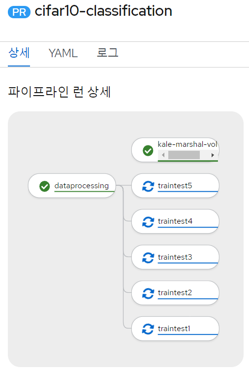

# kale demo

## profile 생성

```yaml
apiVersion: kubeflow.org/v1
kind: Profile
metadata:
  name: kale-demo
spec:
  owner:
    kind: User
    name: anonymous@kubeflow.org
  resourceQuotaSpec: {}
```

## kale notebook 생성

- 필요하다면 image는 다른 것으로 바꾼다. (예: jupyterlab-kale:b1.0.0.torch.titanic)
- 필요하다면 image pull secret을 추가하고, katib-controller의 service account에도 image pull secret을 추가한다.
  - 이 경우 kale compile and run 시 생성되는 pod들에서는 image pull secret이 적용되지 않을 수도 있다.

```yaml
apiVersion: kubeflow.tmax.io/v1
kind: Notebook
metadata:
  labels:
    app: kale-demo-notebook
  name: kale-demo-notebook
  namespace: kale-demo
spec:
  template:
    spec:
      containers:
      - image: 'docker.io/tmaxcloudck/kale-tekton-standalone:230329'
        imagePullPolicy: Always
        name: kale-demo
        resources:
          requests:
            cpu: "0.5"
            memory: 1.0Gi
        volumeMounts:
        - mountPath: /home/jovyan
          name: kale-demo-pvc
        - mountPath: /dev/shm
          name: dshm
      serviceAccountName: default-editor
      volumes:
      - name: kale-demo-pvc
        persistentVolumeClaim:
          claimName: kale-demo-pvc
      - emptyDir:
          medium: Memory
        name: dshm
  volumeClaim:
  - name: kale-demo-pvc
    size: 10Gi
```

## kale notebook에서 코드 테스트

- git clone이나 wget을 통해 필요한 ipynb 파일을 다운로드한다.
  - [titanic_dataset_ml.ipynb](./examples/titanic_dataset_ml.ipynb)
    - raw : https://github.com/tmax-cloud/install-ai-devops/raw/5.0/demo/kale-demo/examples/titanic_dataset_ml.ipynb
  - [cifar10_classification.ipynb](./examples/cifar10_classification.ipynb)
    - raw : https://github.com/tmax-cloud/install-ai-devops/raw/5.0/demo/kale-demo/examples/cifar10_classification.ipynb

## kale panel에서 compile and run

- complie and run 실행시 pipelinerun 리소스 생성을 위해 kale 노트북의 SA인 default-editor에 권한을 부여한다
  - example 디렉토리내의 clusterrole-sample.yaml 및 rolebinding-sample.yaml을 참고하여 clusterrole과 rolebinding 리소스를 생성한다.
  - [clusterrole-sample.yaml](./examples/clusterrole-sample.yaml), [rolebinding-sample.yaml](./examples/rolebinding-sample.yaml)
  - 아래 명령어를 통해 생성하거나 hypercloud console의 yaml import 버튼을 통해 리소스들을 create 한다.
  ```
  kubectl create -f ./examples/clusterrole-sample.yaml
  kubectl create -f ./examples/rolebinding-sample.yaml
  ```
- kale panel을 열고 enable한다.
- code cell 우측의 수정 버튼을 사용해 step 이름과 dependency를 수정한다.
  (cifar10_classification의 경우에는 아래와 같이 고친다.)

- advanced settings에서 image를 입력하고, compile and run을 한다.
  - 이 image는 kale 기반 이미지여야 하고, 코드 실행에 필요한 모든 package가 설치되어 있어야 한다.
  - image를 새로 만들 경우 아래 Dockerfile을 참고한다.

    ```Dockerfile
    FROM docker.io/tmaxcloudck/jupyterlab-kale:b1.0.0
    USER root
    WORKDIR /kale/backend
    RUN pip3 install "torch"
    RUN pip3 install "torchvision"
    RUN pip3 install "pandas"
    RUN pip3 install "seaborn"
    RUN pip3 install "sklearn"
    ```

  - docker 환경에서 build, push하는 것이 권장된다.
    - podman에서 build하는 경우 일부 step에서 실패할 수 있다.

## console에서 확인

- pipeline run의 상세 탭과 로그 탭을 확인한다.




## 주의사항

- kale panel에서 compile and run을 재시도하는 경우, 기존의 pipeline run, pvc를 삭제하고 잠시 기다려주어야 한다.
- notebook을 재생성하려는 경우, 기존의 notebook과 pvc를 삭제하고 잠시 기다려주어야 한다.
