# ai-devops를 사용한 AI 개발 시나리오 가이드

주의 사항 : 
 - notebook-controller-go image b0.0.4 이상 버전, hypercloud-console image 5.0.14.0 이상 버전에서 notebook이 UI에 정상 표기
 - image 버전 확인 방법 : HyperCloud 마스터 노드에서 다음의 커맨드를 입력하여 나오는 image 정보 확인
```
kubectl get deploy -n kubeflow notebook-controller-deployment -o wide
kubectl get deploy -n console-system console -o wide
```
## 간단한 AI 개발과정 소개
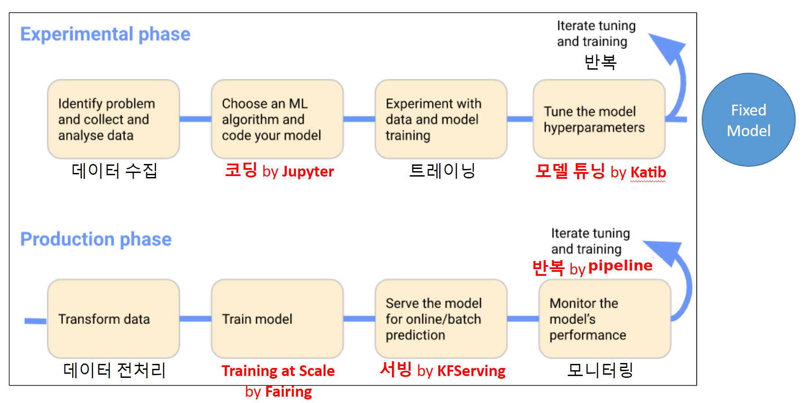
AI 개발과정에는 Experimental 단계와 Production 단계로 나눠 생각해볼 수 있다.

Experimental 단계는 모델 개발 과정으로써 완성도가 높은 ML 모델을 찾는 것이 목적이며,
데이터 수집하기, 모델 코딩하기, 모델 트레이닝 및 테스트, 모델 튜닝하기 과정이 포함된다. *본 시나리오 Step 2,3 과정

Production 단계는 실제 운영 과정으로써 ML모델을 서비스하는 것이 목적이다. 
experimental 단계에서 나온 모델을 토대로 더 큰 스케일에서 모델 트레이닝하기, 모델 서빙하기, 모니터링 과정이 포함된다. *본 시나리오 Step 4,5 과정

## 시나리오 요약
Fashion-MNIST 데이터를 활용하여 Image가 어떤 Fashion Item인지 추론하는 ML service를 만든다.

### 구체적인 순서
  0. 작업을 위한 namespace, pvc 만들기
  1. ML 코드 작성을 위한 notebook 만들기
  2. ML model을 코딩하고, 클라우드 작업을 위한 image 생성하기
  3. hyper-parameter tuning을 위한 katib 사용하기
  4. Model 학습을 위한 tfjob 생성하기
  5. Model 서빙을 위한 kfserving 사용하기
  6. process 자동화를 위한 pipeline 생성하기


---

## Step 0. 작업을 위한 namespace, pvc 만들기
  - ai-devops에서는 작업하려는 namespace를 profile이라는 crd를 통해 관리한다.
  - ai-devops 기능을 사용하기 위한 role, rolebinding등의 k8s리소스 배포 뿐만아니라 istio-injection 활성화와 같은 작업을 자동으로 진행한다.
  - UI의 Import YAML 버튼을 활용하여 demo profile을 생성한다. 
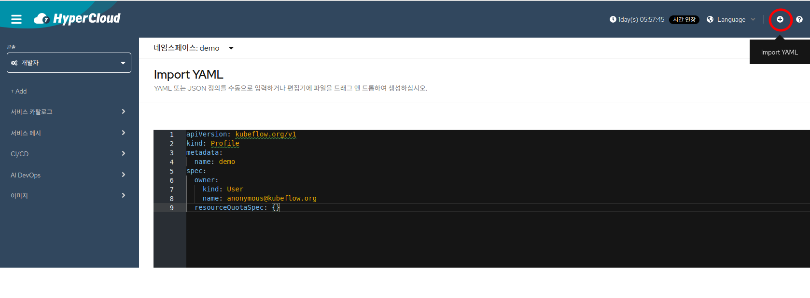 
  - 참고 : [0.profile.yaml](./0.profile.yaml)
<!--
  - 본 시나리오의 작업을 위해 demo-pvc(readWriteMany)를 생성한다.


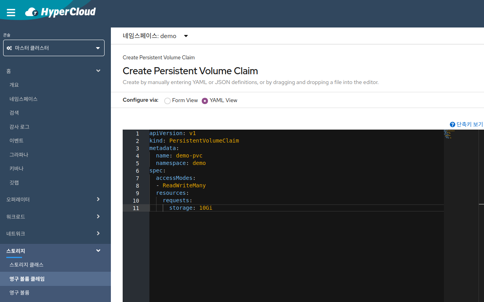  
  - 참고 : [0.pvc.yaml](./0.pvc.yaml)
-->

## Step 1. python 코드 작성을 위한 notebook 만들기 (Notebook Server 메뉴)
  - ai-devops에서는 ML Model 코딩을 위한 web 기반의 python IDE인 JupyterNotebook을 사용할 수 있다.
<!--
  - 위에서 생성한 demo-pvc를 마운트하는 demo-notebook을 생성한다. 
-->
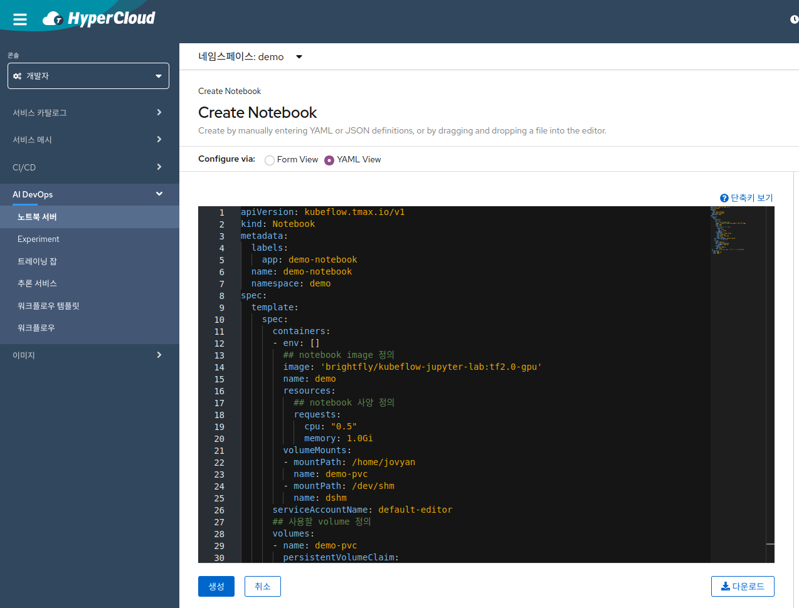
  - 참고 : [1.notebook.yaml](./1.notebook.yaml)
  - 폐쇄망 환경의 경우 : [1.notebook_closednw.yaml](./1.notebook_closednw.yaml)
    * 폐쇄망 환경의 경우에는 1.notebook_closednw.yaml 파일의 image registry 부분을 수정한다.(필수)

*--disable-admission-plugins=ServiceAccount 보안설정 적용을 통한 서비스어카운트토큰 수동 mount가 필요한 환경이 아니라면 [1.notebook_with_sa_name.yaml](./1.notebook_with_sa_name.yaml), 폐쇄망 환경의 경우에는 [1.notebook_closednw_with_sa_name.yaml](./1.notebook_with_sa_name.yaml)을 사용하여 notebook을 생성한다.

*시나리오에서는 여러 커스텀 패키지가 포함된 custom jupyterNotebook image를 사용하였다. (brightfly/kubeflow-jupyter-lab:tf2.0-gpu)

*폐쇄망 환경의 경우 시나리오에서 사용되는 파이썬 패키지가 포함되어 있고 fairing 코드가 수정된 custom jupyterNotebook image를 사용하였다. (tmaxcloudck/kubeflow-jupyter-lab:v0.1)

  - 정상적인 배포를 확인하기 위해, action->connect 버튼을 눌러 jupyter진입을 확인하자.

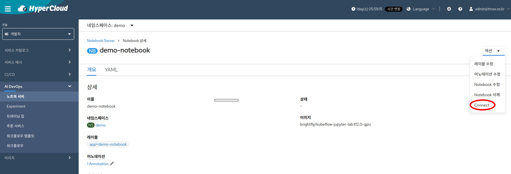


## Step 2. ML model을 코딩하고, 클라우드 작업을 위한 image 생성하기
  - tensorflow 모듈을 활용하여 ML 코드를 작성하고, kubeflow 모듈을 활용하여 ML image를 배포한다.
  - 정상적으로 image를 배포하기 다음 두가지 선행 작업이 필요하다.
      - pod이 떠있는 node에 docker를 설치한다. (kubernetes container-runtime이 crio라면 설치되어있지 않은 경우가 있음)
      - jupyterNotebook container에 docker registry 인증정보를 넣어야 한다.
  - 시나리오에서는 public registry인 docker hub를 활용하였고, 인증이 적용된 private registry 또한 사용 가능하다.
  - 폐쇄망 환경일 경우 아래 인증 방법을 수행할 필요 없이 아래 명령어만 수행한다.
      ```bash
      $ kubectl -n demo create configmap docker-config
      ```

### 인증 방법 1) 로컬 개발 환경의 docker registry 인증정보 사용
 - docker에 로그인 되어있는 로컬 개발환경에서 config.json을 복사하여, jupyterNotebook container에 붙여넣는다.
 - 보통 docker registry 인증정보는 로컬개발환경 /root/.docker/config.json 파일을 찾을 수 있다. ( 안나온다면 다음의 위치를 본다. ${HOME}/.docker/config.json )
 - jupyterNotebook에서 터미널을 열어 /home/jovyan/.docker/config.json으로 복사하자


### 인증 방법 2) docker client활용
  - docker hub와 통신하기 위해, jupyterNotebook에서 Terminal을 열어 다음 커맨드를 입력한다.
```
sudo apt update &&
sudo apt-get install software-properties-common -y && \
curl -fsSL https://download.docker.com/linux/ubuntu/gpg | \
sudo apt-key add - && \
sudo add-apt-repository \
"deb [arch=amd64]
https://download.docker.com/linux/ubuntu $(lsb_release -cs) stable" && \
sudo apt-get update && \
apt-cache policy docker-ce && \
sudo apt-get install -y docker-ce 
```
  - 이후, 다음 커맨드를 입력하여 docker hub login을 진행하자.
```
docker login
```
  - 로그인 후에 config.json이 /home/jovyan/.docker/config.json에 위치하는지 확인하고, 없다면 cp 커맨드를 통해 옮기자.
```
ls home/jovyan/.docker/
cp $HOME/.docker/config.json /home/jovyan/.docker/config.json
```

  - 위의 작업이 끝났다면, 코드 내 DOCKER_REGISTRY를 자신이 사용할 registry로 변경한다.
  - gpu를 사용할 수 없는 환경이라면 코드 내 base image를 brightfly/kubeflow-jupyter-lab:tf2.0-cpu 로 변경한다.
  - 폐쇄망 환경의 경우 fairing에서 사용할 base_image 또한 폐쇄망 내 registry에서 받아오도록 변경한다.
  - Run을 하여 이미지를 배포하자. (UI는 jupyter 버전에 따라 다를 수 있음)
  
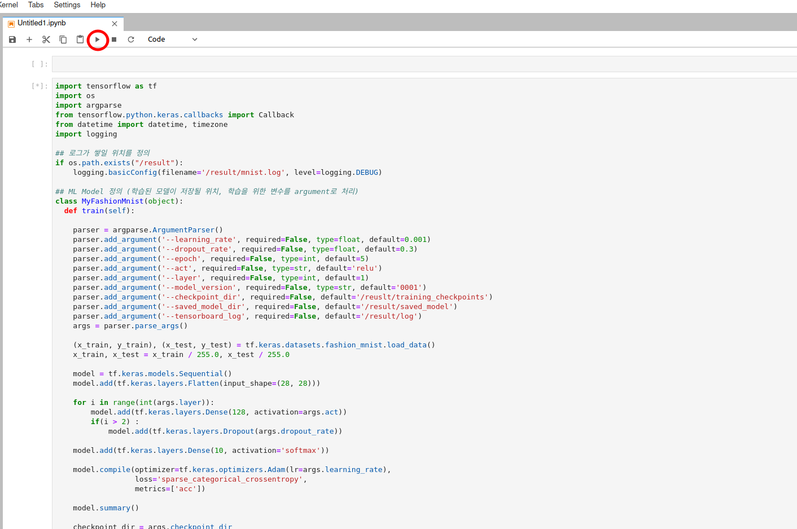
  - 참고 : [fmnist-save-model-renew.ipynb](./fmnist-save-model-renew.ipynb)
  
*kubeflow.fairing.builders.cluster.minio_context가 없다는 에러가 뜬다면, 다음 커맨드를 입력하여 kubeflow-fairing module을 업데이트하자
```
pip install kubeflow-fairing --upgrade
```

*kubeflow-fairing 업데이트 시 ray\[serve\] 관련 에러가 뜬다면, 다음 커맨드를 입력하여 pip를 업데이트하자.
```
pip install --upgrade pip
```

*docker image pull 권한 에러가 뜬다면, 다음 커맨드를 입력하여 service account에 docker image secret을 넣자.
```
kubectl -n demo create secret generic demo-secret \\
    --from-file=.dockerconfigjson=~/.docker/config.json \\
    --type=kubernetes.io/dockerconfigjson

kubectl -n demo patch serviceaccount default -p '{"imagePullSecrets": [{"name": "demo-secret"}]}'
```

*실행이 잘 되지 않는다면, pythonNotebook의 kernel을 리셋 후 다시 code run을 진행하자. (code run 옆에 커널 새로고침 버튼 클릭)

  - 아래와 같이 docker hub에 rhojw/sample-job:3C8CE2EE 의 image가 배포된 것을 확인할 수 있다. 이후 Step에서 사용할 image이다. 


## Step 3. hyper-parameter tuning을 위한 katib 사용하기 (Katib 메뉴)
  - hyper-parameter란 ML 모델 학습에 필요한 컨트롤 변수로, learningRate, dropoutRate, optimizer, neuralNetworkLayerNumber 등이 있다.
  - Katib를 통해 hyper-parameter 값들에 따른 모델 학습의 정확도(Accuracy)를 알 수 있으며, 본격적인 모델 학습에 이 값들이 사용된다.
  - 예시에는 살펴볼 hyper-parameter로 learningRate, dropoutRate를 설정하였다.

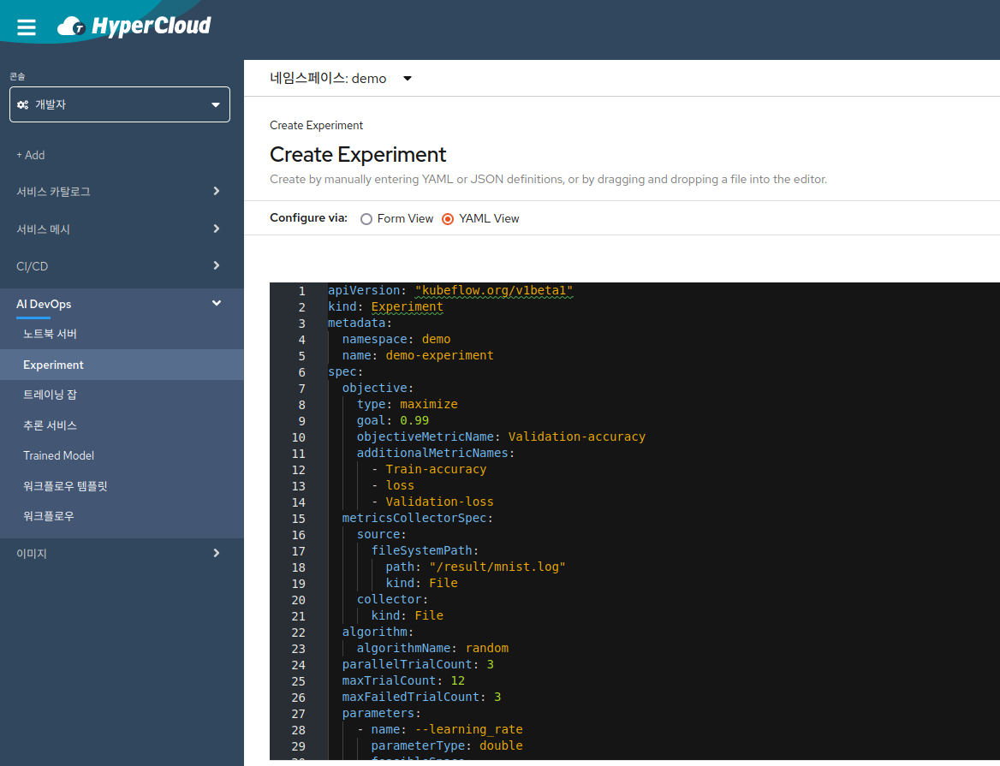
  - 참고 : [3.katib-experiment.yaml](3.katib-experiment.yaml)
  - 모든 작업이 완료된다면, status 항목에서 ML 모델의 정확도가 가장 높은 hyper-parameter를 알려준다.
  - 아래 결과를 해석하자면 validation-accuracy가 최대로 나온 수치는 0.8456이고, 이때의 learningRate는 0.01116... dropoutRate는 0.83610...를 의미한다.

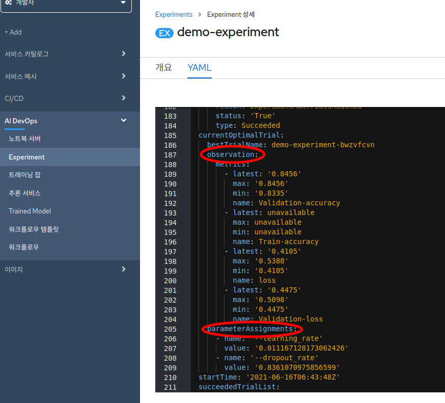

## Step 4. Model 학습을 위한 tfjob 생성하기 (Training Jobs 메뉴)
  - hyper-parameter 탐색까지 끝났다면, 본격적인 Model 학습을 위해 tfJob을 생성한다.
  - Step 3에서 도출된 learningRate와 dropoutRate를 사용하여 모델을 학습한다. (learningRate 0.01116, dropoutRate 0.83610)
  - 시나리오에서는, 모델이 저장될 pvc를 notebook이 사용하는 pvc와 동일한 demo-pvc로 지정하였다.

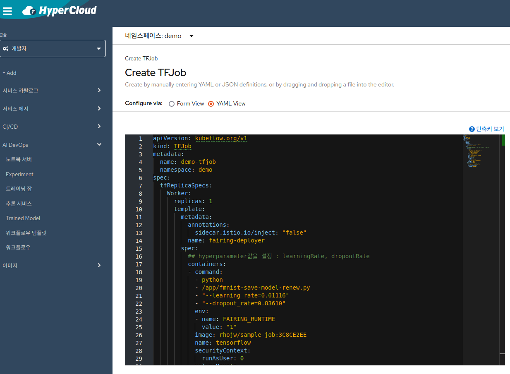
  - 참고 : [4.tfjob.yaml](4.tfjob.yaml)
  - 학습이 종료되면, pvc에 모델이 저장된다. 시나리오에서는 notebook UI를 통해 생성된 모델을 확인 가능하다.


## Step 5. Model 서빙을 위한 kfserving 사용하기 (KFServing 메뉴)
  - 실제 운영에 쓰일 model을 기반으로 server를 만들고, inference service를 제공한다.

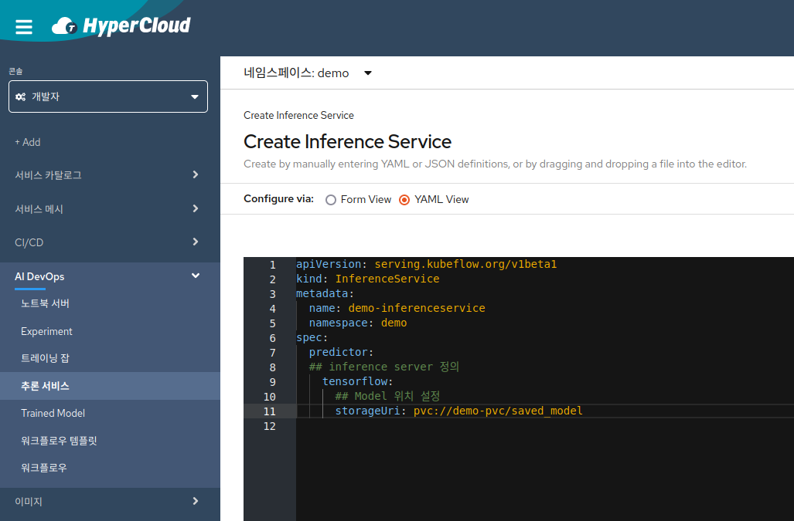
  - 참고 : [5.kfserving-inferenceservice.yaml](5.kfserving-inferenceservice.yaml)
  - demo-inferenceservice가 성공적으로 생성되었다면, curl 을 이용하여 inference 응답이 오는지 확인하자. (마스터 노드에서 테스트 진행)
  ```
  MODEL_NAME=demo-inferenceservice
  CLUSTER_IP=$(kubectl -n istio-system get service istio-ingressgateway -o jsonpath='{.status.loadBalancer.ingress[0].ip}')
  SERVICE_HOSTNAME=$(kubectl get inferenceservice ${MODEL_NAME} -n demo -o jsonpath='{.status.url}' | cut -d "/" -f 3)
  curl -v -H "Host: ${SERVICE_HOSTNAME}" http://$CLUSTER_IP/v1/models/$MODEL_NAME:predict -d '{
    "instances":[
      {
        "flatten_input":[
          0,0,0,0,0,0,0,0,0,0,0,0,0,0,0,0,0,0,0,0,0,0,0,0,0,0,0,0,0,0,0,0,0,0,0,0,0,0,0,0,0,0,0,0,0,0,0,0,0,0,0,0,0,0,0,0,
          0,0,0,0,0,0,0,0,0,0,0,0,0,0,0,0,0,0,0,0,0,0,0,0,0,0,0,0,0,0,0,0,0,0,0,0,0,0,0,0,0,0,0,0,0,0,0,0,0,0,0,0,0,0,0,0,
          0,0,0,0,0,0,0,0,0,0,0,0,0,0,0,0,0,0,0,0,0,0,0,0,0,0,0,0,0,0,0,0,0,0,0,0,0,0,0,0,0,0,0,0,0,0,0,0,0,0,0,0,0,0,0,0,
          0,0,0,0,0,0,0,0,0,0,0,0,0,0,0,0,0,0,0,0,0,0,0,0,0,0,0,0,0,0,0,0,0,0,0,0,0,0,0,0,0,0,0,0,0,0,0,0,0,0,0,0,0,0,0,0,
          0,0,0,0,0,0,0,0,0,0,0,0,0,0,0,0,0,0,0,0,0,0,0,0,0,0,0,0,0,0,0,0,0,0,0,0,0,0,0,0,0,0,0,0,0,0,0,0,0,0,0,0,0,0,0,0,
          0,0,0,0,0,0,0,0,0,0,0,0,0,0,0,0,0,0,0,0,0,0,0,0,0,0,0,0,0,0,0,0,0,0,0,0,0,0,0,0,0,0,0,0,0,0,0,0,0,0,0,0,0,0,0,0,
          0,0,0,0,0,0,0,0,0,0,0,0,0,0,0,0,0,0,0,0,0,0,0,0,0,0,0,0,0,0,0,0,0,0,0,0,0,0,0,0,0,0,0,0,0,0,0,0,0,0,0,0,0,0,0,0,
          0,0,0,0,0,0,0,0,0,0,0,0,0,0,0,0,0,0,0,0,0,0,0,0,0,0,0,0,0,0,0,0,0,0,0,0,0,0,0,0,0,0,0,0,0,0,0,0,0,0,0,0,0,0,0,0,
          0,0,0,0,0,0,0,0,0,0,0,0,0,0,0,0,0,0,0,0,0,0,0,0,0,0,0,0,0,0,0,0,0,0,0,0,0,0,0,0,0,0,0,0,0,0,0,0,0,0,0,0,0,0,0,0,
          0,0,0,0,0,0,0,0,0,0,0,0,0,0,0,0,0,0,0,0,0,0,0,0,0,0,0,0,0,0,0,0,0,0,0,0,0,0,0,0,0,0,0,0,0,0,0,0,0,0,0,0,0,0,0,0,
          0,0,0,0,0,0,0,0,0,0,0,0,0,0,0,0,0,0,0,0,0,0,0,0,0,0,0,0,0,0,0,0,0,0,0,0,0,0,0,0,0,0,0,0,0,0,0,0,0,0,0,0,0,0,0,0,
          0,0,0,0,0,0,0,0,0,0,0,0,0,0,0,0,0,0,0,0,0,0,0,0,0,0,0,0,0,0,0,0,0,0,0,0,0,0,0,0,0,0,0,0,0,0,0,0,0,0,0,0,0,0,0,0,
          0,0,0,0,0,0,0,0,0,0,0,0,0,0,0,0,0,0,0,0,0,0,0,0,0,0,0,0,0,0,0,0,0,0,0,0,0,0,0,0,0,0,0,0,0,0,0,0,0,0,0,0,0,0,0,0,
          0,0,0,0,0,0,0,0,0,0,0,0,0,0,0,0,0,0,0,0,0,0,0,0,0,0,0,0,0,0,0,0,0,0,0,0,0,0,0,0,0,0,0,0,0,0,0,0,0,0,0,0,0,0,0,0
        ]
      }
    ]
  }'
  ```

  - 참고 : [5.demo.sh](5.demo.sh)
  - 아래와 같은 응답이 오게 되는데, 간단하게 해석하자면 inference를 요청한 데이터는 class5(Sandal)일 확률이 0.961이라는 응답이다.

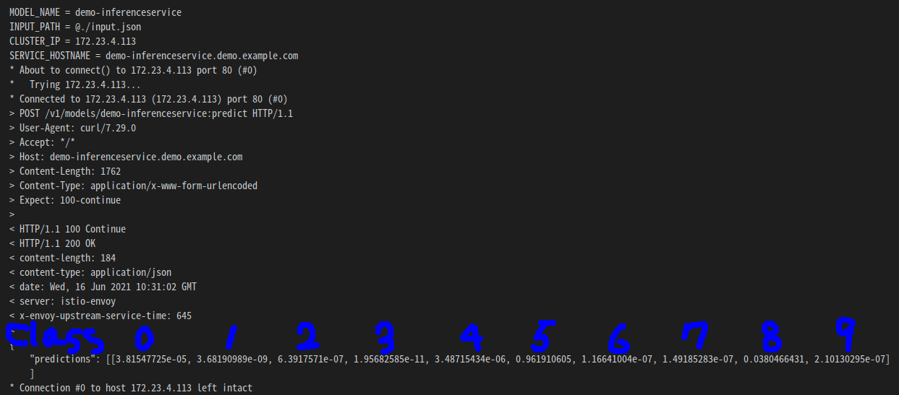

*istio-ca-root-cert configmap을 찾지 못하는 에러가 뜬다면, istiod pod를 재부팅하고 진행하며 생성한 모든 리소스를 삭제하고 다시 시도하자.

### 간단한 웹앱을 통한 inference service 확인
  - 위의 inference service가 실제 어플리케이션에서 어떻게 활용되는지 확인할 수 있다.
  - Docker가 설치된 HyperCloud node에서 다음과 같이 입력한다.
  ```
  sudo docker run -p19000:5000 brightfly/fminst-webui:latest 
  ```
  - 웹브라우저 주소창에 http://{node IP}:19000/?model=demo-inferenceservice&name=demo-inferenceservice.demo.example.com&addr={istio-system nameSpace의 istio-ingressgateway ExternalIP}를 입력하여 접속

*istio-ingressgateway의 ExternalIP는 HyperCloud UI Network-service 메뉴에서 확인하거나 마스터 노드에서 다음 커맨드를 입력하여 확인한다.

```
kubectl get service -n istio-system istio-ingressgateway
```
  - 아래와 같이, 그림이 어떤 Fashion Item인지 유추해주는 간단한 webApp이다.

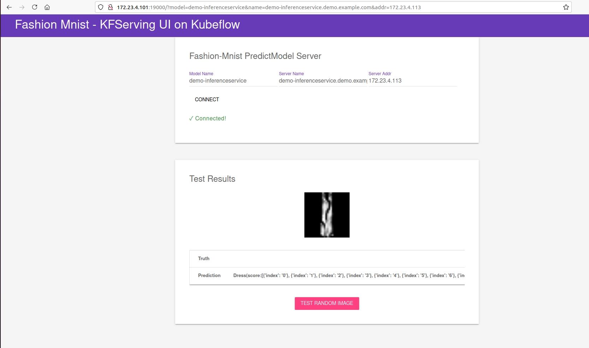

*master node에 docker가 없다면 다음 커맨드를 입력하여 pod로 띄워 확인하자.
```
kubectl run demo-webui -n demo --image=brightfly/fminst-webui:latest --port=5000 --hostport=19000
```

## Step 6. process 자동화를 위한 pipeline 생성하기 (tekton)
  - 실제 운영과정에서는 새로운 데이터를 통해 모델을 다시 학습하고 배포하는 일련의 작업들을 해야할 경우가 생기는데, 이를 자동화 해주는 메뉴이다.
  - 코드 Run을 통해 생성된 fmnist_pipeline.yaml을 통해 pipelinerun을 배포한다. : [6.workflow_tekton.yaml](6.workflow_tekton.yaml)    

  - 참고: 생성된 pipelinerun yaml파일은 namespace가 지정되어있지 않기 때문에 파이프라인 정의시에 명시한 namespace (ex)demo에 pipelinerun을 배포하여야한다.    

*demo 네임스페이스의 service account가 isvc를 생성할수 있도록 다음 yaml을 이용하여 rolebinding을 적용한다.
참고 : [6.kfserving-rolebinding.yaml](./6.kfserving-rolebinding.yaml)

*kfp_tekton 패키지가 설치되어 있지 않다면 아래 명령어를 통해 kfp_tekton pakage를 install한다.
```
pip install kfp_tekton
```
*AttributeError: 'Container' object has no attribute 'openapi_types'라는 에러 메시지가 뜬다면, 다음 커맨드를 입력하여 kubernetes python pakage를 업그레이드 한다.
```
pip install --upgrade kubernetes
```
*serving 같은 경우 kfp python module을 사용하여 image로 만들고, 이를 task로 이용하여 생성하였다. 참고 : KFServing-fairing.ipynb

*v1beta1 모듈을 찾을 수 없다는 에러가 뜬다면, 다음 커맨드를 입력하여 kfserving을 업데이트하자.
```
pip install --upgrade kfserving==0.5.0
```

## 기타. kfserving을 통한 multi model serving 시나리오
  * 목적 : `하나의 ml 서버에서 여러 모델들을 추론할 수 있는 multi-model ml service를 생성한다.`
  참고 사항 : 
   - kfserving 0.5 version 기준 multi-model inferenceservice agent에서 pvc를 지원하지 않아 minio storage server 사용
   - 본 시나리오에서는 Tensorflow의 savedmodel 방식 사용
  * 순서 
    1. 이전에 생성한 notebook server를 이용, [mms-fashion.ipynb](mms-fashion.ipynb)와 [mms-mnist.ipynb](mms-mnist.ipynb)를 참고하여 model code 작성 후 학습 진행
  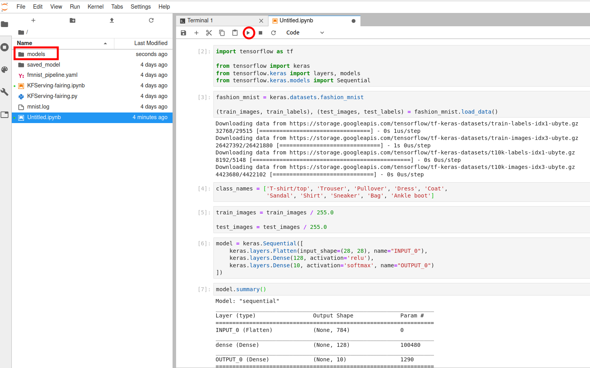
    2. InferenceService에서 모델 로딩을 위한 minio 관련 설정 셋팅
      - 'MINIO_ACCESS_KEY'와 'MINIO_SECRET_KEY' 확인(BASE64)
      - minio s3 endpoint 접근 설정
  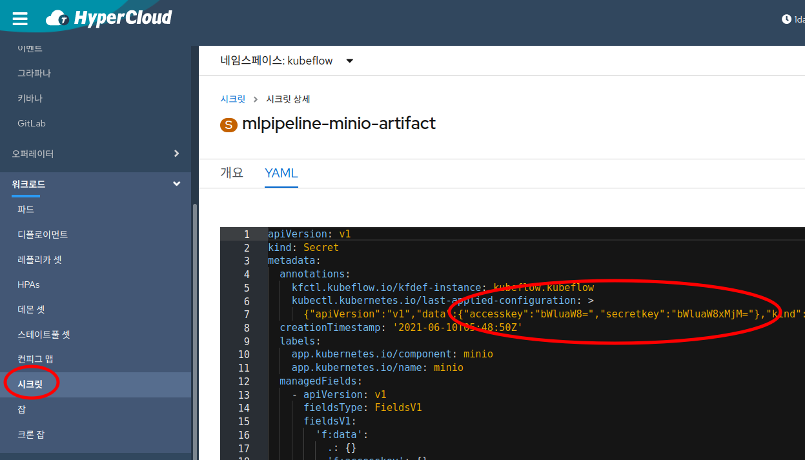     
   
  참고 : [7.s3_secret.yaml](./7.s3_secret.yaml)    
  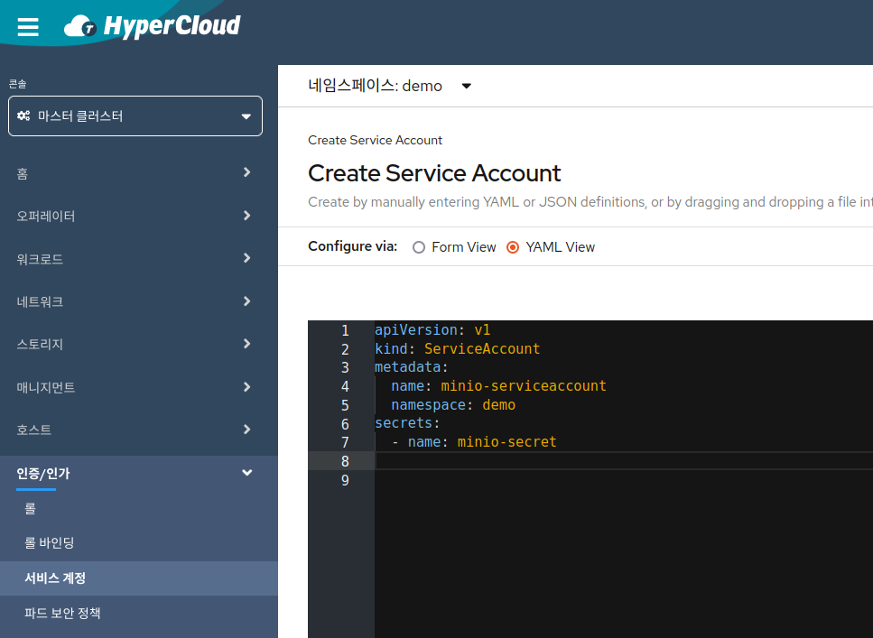 
  참고 : [7.service-account.yaml](./7.service-account.yaml)    
    3. InferenceService 생성
      - multi-model serving을 위한 inference server 생성
      - 기존의 inferenceservice와 달리 storageuri 제거 및 s3 endpoint 연동
      - READY가 True 상태라면 정상동작 하는 것이고 생성시 5분가량 시간이 소요될 수 있다. 
   
  참고 : [7.inferenceservice.yaml](./7.inferenceservice.yaml)        
    4. minio storage server에 업로드
   - minio-client 이용 checkpoint upload
   - Notebook에서 terminal을 열고 아래 명령어를 통해 minio client 설치      
```bash
wget https://dl.min.io/client/mc/release/linux-amd64/mc
chmod +x mc
```
   - minio pod IP와 port 확인       
  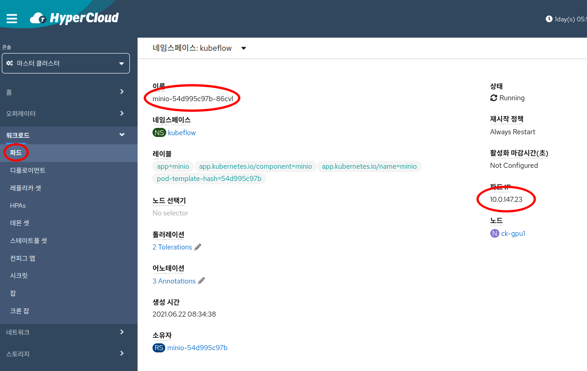     
  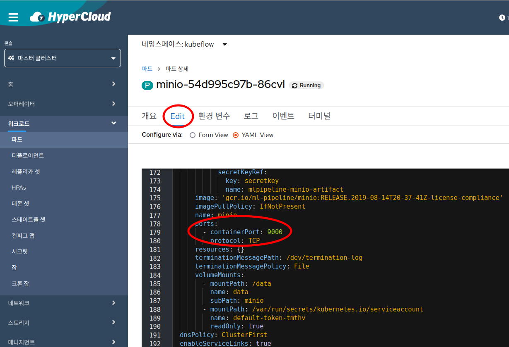     
   - minio client를 다운로드 받은 터미널 경로에서 확인한 IP, port를 사용하여 minio server 접근(access key와 secret key는 이전 단계에서 확인 했던 것을 사용)        
```bash
./mc config host add myminio http://${MINIO_IP}:${MINIO_PORT} ${MINIO_ACCESS_KEY} ${MINIO_SECRET_KRY}
```
   - 해당 minio server에서 bucket을 만들고 checkpoint 업로드 후 정상 업로드 확인

```bash
# bucket 생성
./mc mb myminio/triton
# 업로드
./mc cp -r models/ myminio/triton/models
# 정상 업로드 확인
./mc tree myminio/
```
  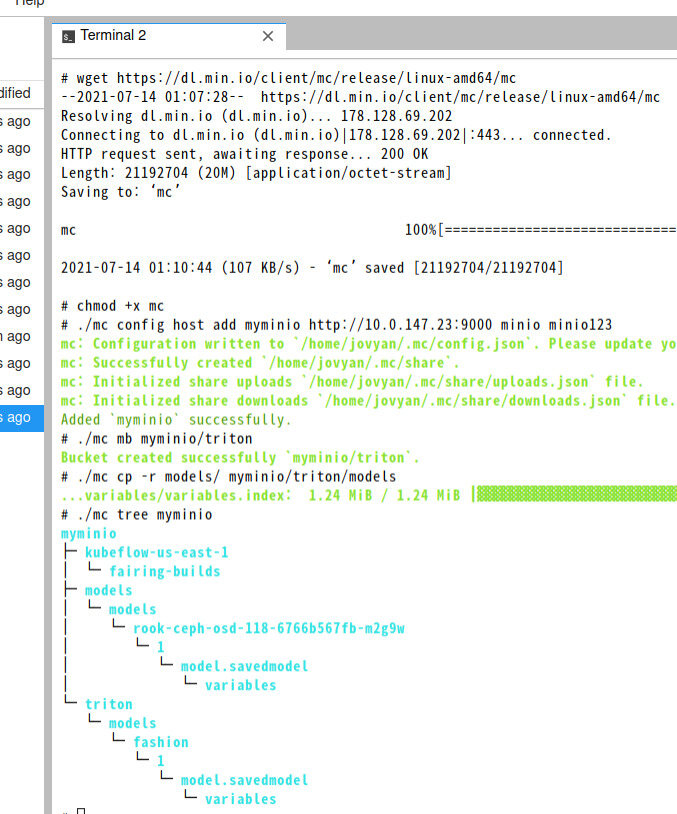    
   5. trainedmodel 생성
  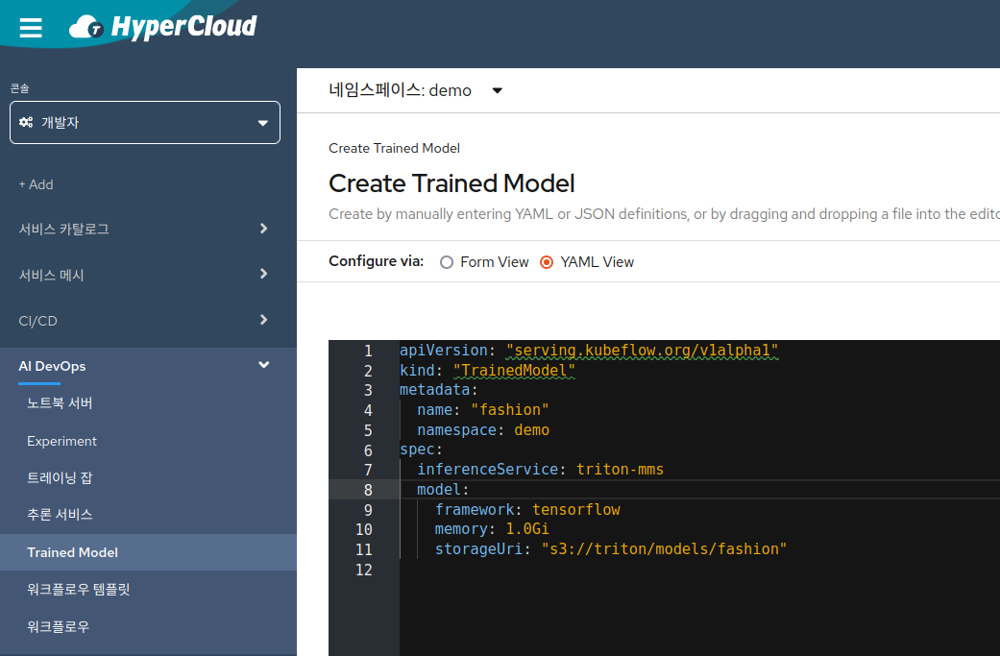
  참고 : [7.fashion.yaml](7.fashion.yaml) 
          [7.mnist.yaml](7.mnist.yaml) 
   - 학습한 model들을 이용한 inference test 
    - InferenceService로 request를 위한 환경 변수 설정 (master node에서 진행)

```bash
# INGRESS에서 인식할 수 있도록 SERVICE_HOSTNAME 설정
SERVICE_HOSTNAME=$(kubectl get inferenceservices triton-mms -o jsonpath='{.status.url}' -n mms | cut -d "/" -f 3)
CLUSTER_IP=$(kubectl -n istio-system get service istio-ingressgateway -o jsonpath='{.status.loadBalancer.ingress[0].ip}')
```

   - Request가 정상적으로 가는지 확인
     - 정상적으로 가지 않거나 다음과 같이 서버의 metadata가 나오지 않는다면 InferenceService pod의 `ClusterIP` 또는  service를 통해서 expose해서 해당 url을 사용해야함 (endpoint는 동일)

```bash
curl -v -H "Host: ${SERVICE_HOSTNAME}" http://${CLUSTER_IP}/v2

{"name":"triton","version":"2.2.0","extensions":["classification","sequence","model_repository","schedule_policy","model_configuration","system_shared_memory","cuda_shared_memory","binary_tensor_data","statistics"]}
```


   - 모델 endpoint로 inference 요청

```bash
MODEL_NAME=mnist
curl -v -X POST -H "Host: ${SERVICE_HOSTNAME}" http://${CLUSTER_IP}/v2/models/$MODEL_NAME/infer -d @./${MODEL_NAME}.json


{"model_name":"mnist","model_version":"1","outputs":[{"name":"OUTPUT_0","datatype":"FP32","shape":[1,10],"data":[5.710052656399123e-13,1.599723731260383e-8,3.309397755835164e-10,1.5357866800513876e-7,3.9533000517621988e-7,2.6684685017208667e-10,8.332194661878414e-14,0.9999977350234985,1.66733338247127e-9,0.0000017882068732433254]}]}
```

   - 두 개 모델에 대해서 inference가 가능하다면 Multi Model Serving이 된 것이다.


