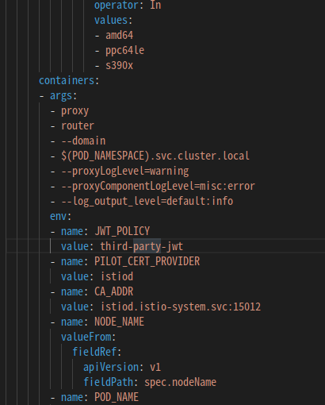
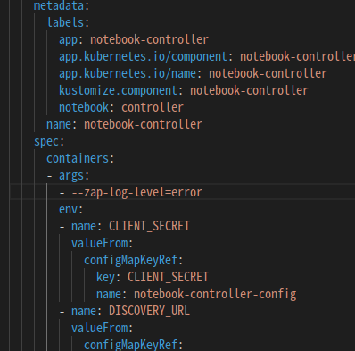
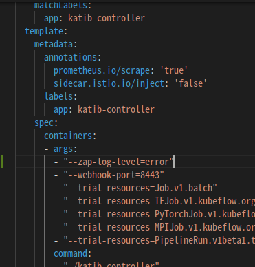
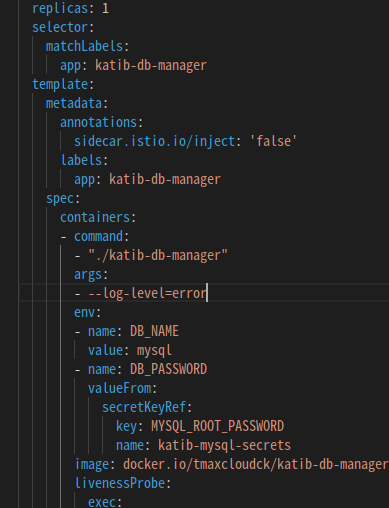
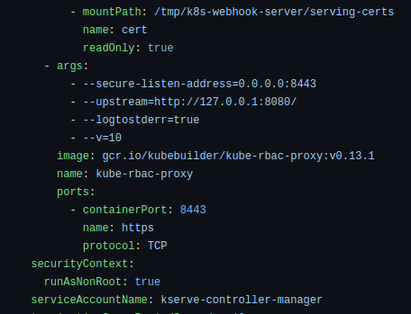
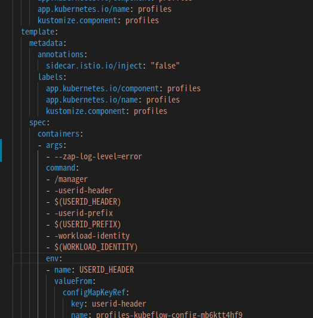
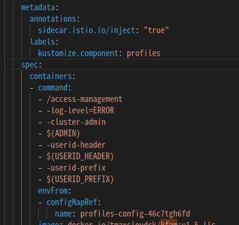
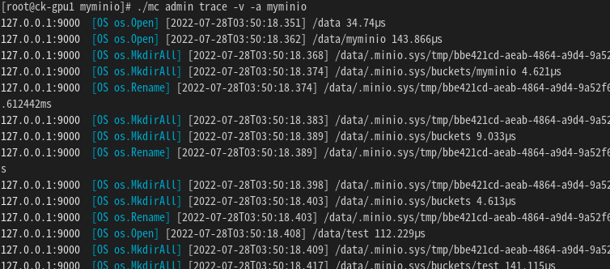

# ai-devops 모듈별 Log level 설정 가이드

Log level setting for AI-DEVOPS


## cluster-local-gateway (istio-system namespace)
* cluster-local-gateway는 다음 이미지와 같이 deployment의 container args에 --log_output_level을 이용하여 로그레벨 설정이 가능하다
* default:info, none, error, warn, info, debug 설정 가능
  

## knative-serving
* knative-serving은 zap logging library를 이용하여 로그를 저장하며 debug, info, warn, error, dpanic, panic, fatal의 로그 레벨을 지원한다. 
    * default로 설정된 log level은 info이며 knative-serving 네임스페이스의 config-logging이라는 configmap 리소스를 활용하여 로그레벨을 설정할 수 있다.
    * config-logging 컨피그맵의 zap-logging-config 데이터는 모든 kantive component들의 베이스 설정이고 loglevel.controller, loglevel.autoscaler 등을 이용하여 각각의 컴포넌트들의 로그 레벨을 오버라이딩 할 수 있다.
    * 다음 yaml파일을 각 컴포넌트별 원하는 로그레벨에 맞게 수정한후 컨피그맵을 생성하고 해당 컴포넌트 파드를 재시작한다.[knative-config-logging.yaml](./knative-config-logging.yaml)
      아래 명령어의 rollout 부분에 로그레벨을 적용할 deployment 네임을 입력하고 적용한다.
    ```bash
    $ kubectl apply -f knative-config-logging.yaml
    $ kubectl rollout restart deployment ${ex)autoscaler} -n knative-serving
    ```

## notebook-controller & notebook-gatekeeper
1. notebook controller는 zap logging library를 이용하여 로그를 저장하며 다음과 같은 log level을 사용할 수 있다.
    * debug, info, error, integer value (>0)     
    * 다음 이미지와 같이 notebook-controller-deployment에 컨테이너 args를 추가하여 로그 레벨을 설정한다
        * (참고)notebook controller 이미지의 zap.Options.Development 설정을 기존 true에서 false 처리하였음(최신버전 b0.2.10, false처리 b0.2.4 이상버전)    
    
2. notebook-gatekeeper
    * ai-devops install 과정에서 사용하는 ai-devops.config에 원하는 로그레벨을 설정하여 적용한다
    * GATEKEEPER_VERSION = 사용할 Gatekeeper의 이미지 버전 EX) v1.0.2
    * LOG_LEVEL = Gatekeeper에서 설정할 로그 레벨 EX) error
        * debug, info, warn, error, fatal, panic 의 6단계로 설정 가능    
    (참고)[ai-devops.config 설정](https://github.com/tmax-cloud/install-ai-devops#step-1-ai-devopsconfig-%EC%84%A4%EC%A0%95)   

## katib
(참고) katib-ui 제거
1. katib-controller
    * katib-controller는 zap logging library를 이용하여 로그를 저장하며 다음과 같은 log level을 사용할 수 있다.    
    * debug, info, error, integer value (>0)    
    * 다음 이미지와 같이 katib-controller deployment에 컨테이너 args를 추가하여 로그 레벨을 설정한다.
        * (참고)kubeflowkatib/katib-controller 이미지의 zap.Options.Development 설정을 false 처리하였음(tmaxcloudck/katib-controller:v0.14-lls)       
      
2. katib-db-manager
    * katib-db-manager는 klog를 이용하여 로그를 저장한다. klog package는 V func를 이용하여 verbosity를 구현하는데 현재 info level만 지원하므로 로그가 필터링되더라도 출력은 info로 통일된다.
    * info, warn, error, fatal
    * 다음 이미지와 같이 katib-db-manager deployment에 컨테이너 args를 추가하여 로그 레벨을 설정한다.
        * (참고)kubeflowkatib/katib-db-manager 이미지의 코드를 수정하였음(tmaxcloudck/katib-db-manager:v0.14-lls)  
          
3. katib-mysql
    * (예시) 아래 명령어를 수행하여 mysql의 admin 권한을 가진 계정으로 접속 후 variable setting
    ```bash
    $ kubectl -n kubeflow exec -it {katib-mysql POD 이름} /bin/sh
    $ mysql -uroot -p
    $ test
    $ show variables like 'log%'; //log error verbosity 확인
    $ SET GLOBAL log_error_verbosity = 3; //log error verbosity setting, 기본값은 2, 1(errors only), 2(errors and warnings), 3(errors, warnings, and notes)
    ```

## kserve
1. kserve-controller-manager
    * kfserving-controller는 zap logging library를 이용하여 로그를 저장하며 다음과 같은 log level을 사용할 수 있다.    
    * debug, info, error, integer value (>0)    
    * 다음 이미지와 같이 kserve-controller-manager deployment에 컨테이너 args를 추가하여 로그 레벨을 설정한다.
        * (참고)kserve/kserve-controller 이미지의 zap.Options.Development 설정을 false 처리하였음(tmaxcloudck/kserve-controller-manager:b0.10.0-tw2-lls2)       
        * (참고)위의 tmaxcloudck/kserve-controller-manager:b0.10.0-tw2-lls2 이미지는 trainedmodel validating webhook 추가 이미지임
      
2. kube-rbac-proxy    
    * 다음 이미지와 같이 sts container args의 -v 플래그 사용하여 로그레벨 지정
    * 0 = error, 10 = info
       

## profiles-deployment
1. profiles-controller
    * profiles-controller는 zap logging library를 이용하여 로그를 저장하며 다음과 같은 log level을 사용할 수 있다.    
    * debug, info, error, integer value (>0)    
    * 다음 이미지와 같이 profiles-deployment에 컨테이너 args를 추가하여 로그 레벨을 설정한다.
        * (참고)gcr.io/kubeflow-images-public/profile-controller 이미지의 zap.Options.Development 설정을 false 처리하였음(tmaxcloudck/profiles-controller:v1.6.1-lls)       
      
2. kfam
    * kfam은 로그레벨 설정을 위해 기존 go log package에서 klog로 로그 패키지를 변경하여 빌드하였음 
    * FATAL, ERROR, WARN, ERROR
    * tmaxcloudck/kfam:v1.6.1-lls
    * 다음 이미지와 같이 kfam container command에 -log-level flag를 추가하여 로그레벨을 설정한다. ex) -log-level=ERROR
      

## training-operator
* (참고) 기존의 분리되어있던 tfjob, pytorchjob operator를 통합하고 mpijob, xgboostjob등 다른 트레이닝 job들도 관리하는 training operator로 수정하였음.
* training-operator는 zap logging library를 이용하여 로그를 저장하며 다음과 같은 log level을 사용할 수 있다.    
* debug, info, error, integer value (>0)
* 다음 이미지와 같이 training-operator deployment에 컨테이너 args를 추가하여 로그 레벨을 설정한다.
* (참고)zap.Options.Development 설정을 false 처리하였음(tmaxcloudck/training-operator:v1.5-lls)       
  

## minio
* minio는 default로 심각한 에러만 기록되도록 설계되었으며 모든 요청을 기록하려면 아래의 명령어를 통해 minio client를 사용한다.
    ```bash 
    $ wget https://dl.minio.io/client/mc/release/linux-amd64/mc  *minio client 다운로드
    $ chmod +x mc
    $ ./mc --help
    $ ./mc alias set <ALIAS> <MINIO POD IP:PORT> [YOUR-ACCESS-KEY] [YOUR-SECRET-KEY] *EX)./mc alias set myminio http://10.244.148.54:9000 minio minio123
    $ ./mc admin trace [FLAGS] TARGET *EX) ./mc admin trace -v -a myminio, *syntax 설명-v: verbose, -a: all, -e: error
    ```
 

## application-controller && katib-ui
* hypercloud 5.1.1 버전 ai-devops 부터 제거


