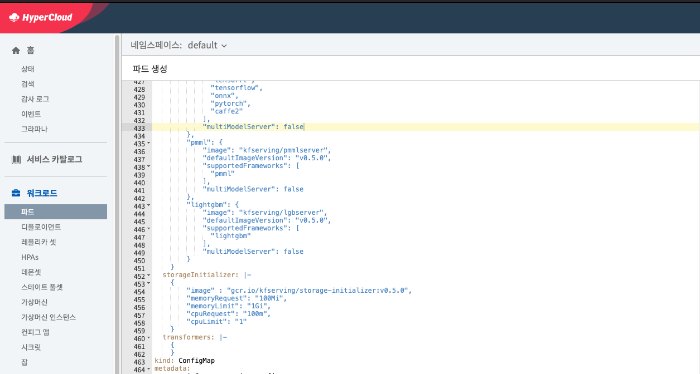
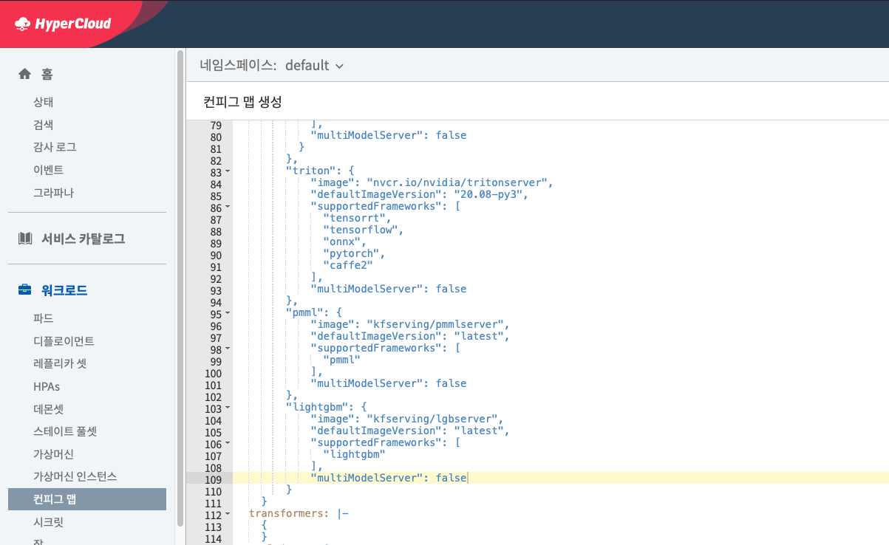
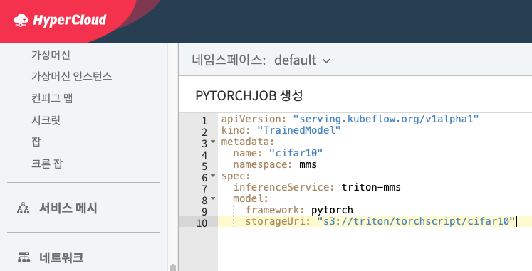
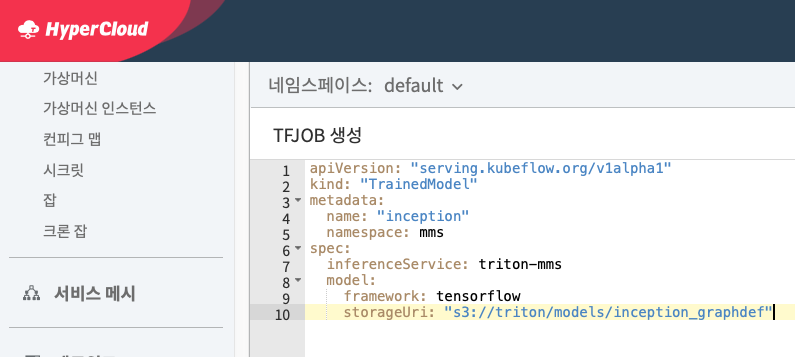

# Kfserving Multi Model Serving 가이드

주의 사항:

- kfserving 0.5 버전 이상 필요
- `inferenceservice.yaml` 의 Triton의 `multiModelServer` flag가 true로 세팅해야 multi-model serving을 사용 가능함 (또는 `kfserving/install/v0.5.0/kfserving.yaml`로 설치 시 해당 파일에서 수정)





- 0.5 버전 기준 multi-model serving InferenceService의 `agent`에서 s3, gs 프로토콜만을 지원하여 minio storage server 사용
    - 본 데모에서는 kubeflow에서 사용중인 minio storage server를 이용함


# Multi Model Serving을 위한 세팅

- 작업을 위한 namespace 생성


```bash
kubectl apply -f profile.yaml
```

- triton inference server image digest시 auth에 필요한 `[nvcr.io](http://nvcr.io)` tag resolution을 skip하기 위한 명령어

```bash
kubectl patch cm config-deployment --patch '{"data":{"registriesSkippingTagResolving":"nvcr.io"}}' -n knative-serving
```

- bert 같은 큰 모델 다운로드 시 timeout (default: 120s)을 방지하기 위해 progess deadline 증가

```bash
kubectl patch cm config-deployment --patch '{"data":{"progressDeadline": "600s"}}' -n knative-serving
```

### minio 설정

- `MINIO_SECRET_KEY`와 `MINIO_ACCESS_KEY` 확인

```bash
kubectl get pods -l app=minio -o jsonpath={.items[0].spec.containers[0].env} -n kubeflow

[{"name":"MINIO_ACCESS_KEY","value":"minio"},{"name":"MINIO_SECRET_KEY","value":"minio123"}]
```

- minio service 확인

```bash
kubectl get svc -l app=minio -o name -n kubeflow | cut -d "/" -f 2

minio-service
```

- InferenceService의 `agent`에서 minio의 s3 endpoint에 접근할 수 있도록 설정
    - 만약 이전 단계에서의 minio의 `MINIO_ACCESS_KEY` 또는 `MINIO_SECRET_KEY`가 다른 경우 변경해서 적용

```bash
kubectl apply -f s3_secret.yaml
```


- 별도의 namespace에서 진행하는 경우 minoi-service 연결
    - 본 예제에서는 mms라는 namespace에서 진행

```
kubectl apply -f external_service.yaml
```


# InferenceService 생성하기

- Multi Model Serving을 위한 InferenceService (inferenceserver) 생성
    - 기존의 InferenceService와 다르게 `StorageUri`를 제외하고 생성
    - s3 endpoint를 위한 serviceaccount 연결

```bash
kubectl apply -f multi_model_triton_server.yaml
```


- InferenceService가 정상적으로 생성 되었는지 확인
    - 아래의 결과처럼 `READY`가 True이면 정상

```bash
kubectl get inferenceservice triton-mms -n mms

NAME   URL                                                    READY   AGE
triton-mms   http://triton-mms.default.35.229.120.99.xip.io   True    8h
```

- InferenceService로 request를 위한 환경 변수 설정

```bash
# INGRESS에서 인식할 수 있도록 SERVICE_HOSTNAME 설정
SERVICE_HOSTNAME=$(kubectl get inferenceservices triton-mms -o jsonpath='{.status.url}' -n mms | cut -d "/" -f 3)
CLUSTER_IP=$(kubectl -n istio-system get service kfserving-ingressgateway -o jsonpath='{.status.loadBalancer.ingress[0].ip}')
```

- Request가 정상적으로 가는지 확인
    - 정상적으로 가지 않거나 다음과 같이 서버의 metadata가 나오지 않는다면 InferenceService pod의 `ClusterIP` 또는  service를 통해서 expose해서 해당 url을 사용해야함 (endpoint는 동일)

```bash
# INGRESS
curl -v -H "Host: ${SERVICE_HOSTNAME}" http://${CLUSTER_IP}/v2

# Expose
POD_NAME=$(kubectl get pods -l serving.kubeflow.org/inferenceservice=triton-mms -o name -n mms | cut -d "/" -f 2)
kubectl expose pod ${POD_NAME} --type=NodePort --name serving-service -n mms
curl -v http://${NODE_IP}:${TARGET_PORT}/v2 # curl -v  http://172.23.4.101:31582/v2

# Or use POD CLUSTER IP
curl -v http://${CLUSTER_IP}:${PORT}/v2 # curl -v http://10.0.147.0:8080/v2

# Result
{"name":"triton","version":"2.2.0","extensions":["classification","sequence","model_repository","schedule_policy","model_configuration","system_shared_memory","cuda_shared_memory","binary_tensor_data","statistics"]}
```

# TrainedModel 생성하기

## 예제로 사용할 model 다운로드

- 모델을 다운로드 받고 minio storage에 파일을 추가하기 위해 [minio client](https://docs.min.io/docs/minio-client-complete-guide.html)와 [gsutil](https://cloud.google.com/storage/docs/gsutil/?hl=ko)를 설치

```bash
# minio client
wget https://dl.min.io/client/mc/release/linux-amd64/mc # Download minio client binary
chmod +x mc
MINIO_IP=$(kubectl get pod -l app=minio -n kubeflow -o jsonpath='{.items[0].status.podIP}')
MINIO_PORT=$(kubectl get pod -l app=minio -n kubeflow -o jsonpath='{.items[0].spec.containers[0].ports[0].containerPort}') # 9000
./mc config host add myminio http://$MINIO_IP:$MINIO_PORT minio minio123 # minio.yaml 에서 변경한 ACCESS_KEY_ID 와 SECRET_ACCESS_KEY 사용
# gsutil
wget https://storage.googleapis.com/pub/gsutil.tar.gz # Download gsutil binary
tar xfz gsutil.tar.gz -C .
```

- 모델 다운로드 및 minio에 추가
    - cifar10 모델 다운로드

```bash
mkdir -p models
cd gsutil

# In gsutil binary path
./gsutil cp -r gs://kfserving-examples/models/torchscript/cifar10 ../models

# Upload cifar10 model to minio server
cd ..
./mc mb myminio/triton
./mc cp -r models/cifar10 myminio/triton/torchscript
```

- inception 모델 다운로드 (**사용할 inception 모델은 output에서 label이 필요하여 config.pbtxt와 label을 미리 준비해둠. download url 참고**)

```bash
# Tensorflow inception (Download code from https://github.com/triton-inference-server/server/blob/master/docs/examples/fetch_models.sh)
mkdir -p ./models/inception_graphdef/1
wget -O /tmp/inception_v3_2016_08_28_frozen.pb.tar.gz \
     https://storage.googleapis.com/download.tensorflow.org/models/inception_v3_2016_08_28_frozen.pb.tar.gz
(cd /tmp && tar xzf inception_v3_2016_08_28_frozen.pb.tar.gz)
mv /tmp/inception_v3_2016_08_28_frozen.pb ./models/inception_graphdef/1/model.graphdef
# Upload inception model to minio server
./mc cp -r models/inception_graphdef myminio/triton/models
```

- 모델이 정상적인 path에 있는지 확인
    - 브라우저를 통해서도 확인 가능

```bash
# In shell
./mc tree myminio/

myminio
└─ triton
   ├─ models
   │  ├─ inception_graphdef
   │  │  └─ 1
   └─ torchscript
      └─ cifar10
         └─ 1
```

```bash
# Get minio server url
./mc config host ls
```

## Trained Model 생성 및 Multi Model Serving 테스트

### Cifar10 model

- Trained Model 생성

```bash
kubectl apply -f trained_model1.yaml
```



- 정상적으로 생성되었는지 확인

```bash
kubectl get trainedmodel -n mms

NAME            URL                                                                    READY   AGE
cifar10         http://triton-mms.example.com/v2/models/cifar10/infer                 22h
```

- Agent에서 정상적으로 모델을 다운로드하였는지  확인

```bash
SERVER=$(k get pod -l serving.kubeflow.org/inferenceservice=triton-mms -o name -n mms)
kubectl -n mms logs $SERVER agent

{"level":"info","ts":1605449512.0457177,"logger":"Watcher","msg":"Processing event","event":"\"/mnt/configs/..data\": CREATE"}
{"level":"info","ts":1605449512.0464094,"logger":"modelWatcher","msg":"removing model","modelName":"cifar10"}
{"level":"info","ts":1605449512.0464404,"logger":"modelWatcher","msg":"adding model","modelName":"cifar10"}
{"level":"info","ts":1605449512.046505,"logger":"modelProcessor","msg":"worker is started for","model":"cifar10"}
{"level":"info","ts":1605449512.0465908,"logger":"modelProcessor","msg":"unloading model","modelName":"cifar10"}
{"level":"info","ts":1605449512.0487478,"logger":"modelProcessor","msg":"Downloading model","storageUri":"s3://triton/torchscript/cifar10"}
{"level":"info","ts":1605449512.048788,"logger":"Downloader","msg":"Downloading to model dir","modelUri":"s3://triton/torchscript/cifar10","modelDir":"/mnt/models"}
{"level":"info","ts":1605449512.0488636,"logger":"modelAgent","msg":"Download model ","modelName":"cifar10","storageUri":"s3://triton/torchscript/cifar10","modelDir":"/mnt/models"}
{"level":"info","ts":1605449512.0488217,"logger":"modelOnComplete","msg":"completion event for model","modelName":"cifar10","inFlight":1}
{"level":"info","ts":1605449512.6908782,"logger":"modelOnComplete","msg":"completion event for model","modelName":"cifar10","inFlight":0}
```

- InferenceService에서도 memory에 로드했는지 확인
    - status code가 200이면 정상

```bash
MODEL_NAME=cifar10
curl -H "Host: ${SERVICE_HOSTNAME}" http://${CLUSTER_IP}/v2/models/${MODEL_NAME}/ready
```

```bash
kubectl logs $SERVER kfserving-container

I1115 14:11:52.060489 1 model_repository_manager.cc:737] loading: cifar10:1
I1115 14:11:52.061524 1 libtorch_backend.cc:217] Creating instance cifar10_0_0_cpu on CPU using model.pt
I1115 14:11:52.690479 1 model_repository_manager.cc:925] successfully loaded 'cifar10' version 1
```

- 모델 endpoint로 prediction 요청

```bash
MODEL_NAME=cifar10

curl -v -X POST -H "Host: ${SERVICE_HOSTNAME}" http://${CLUSTER_IP}/v2/models/$MODEL_NAME/infer -d @./${MODEL_NAME}.json

{"model_name":"cifar10","model_version":"1","outputs":[{"name":"OUTPUT__0","datatype":"FP32","shape":[1,10],"data":[-2.0964813232421877,-0.1370079517364502,-0.509565532207489,2.795621395111084,-0.560547947883606,1.9934228658676148,1.1288189888000489,-1.4043134450912476,0.6004878282546997,-2.123708486557007]}]}
```

### Inception model

- Trained Model 생성
~~사진추가~~

```bash
kubectl apply -f trained_model2.yaml
```




- 정상적으로 생성되었는지 확인

```bash
kubectl get trainedmodel -n mms

NAME            URL                                                                    READY   AGE
cifar10         http://triton-mms.example.com/v2/models/cifar10/infer                 22h
inception       http://triton-mms.example.com/v2/models/inception/infer               20h
```

- Agent에서 정상적으로 모델을 다운로드하였는지 확인

```bash
SERVER=$(k get pod -l serving.kubeflow.org/inferenceservice=triton-mms -o name -n mms)
kubectl logs $SERVER agent -n mms


{"level":"info","ts":"2021-02-25T06:05:52.384Z","caller":"agent/watcher.go:103","msg":"Processing event \"/mnt/configs/..data\": CREATE"}
{"level":"info","ts":"2021-02-25T06:05:52.385Z","caller":"agent/watcher.go:173","msg":"adding model inception"}
{"level":"info","ts":"2021-02-25T06:05:52.386Z","caller":"agent/puller.go:121","msg":"Worker is started for inception"}
{"level":"info","ts":"2021-02-25T06:05:52.386Z","caller":"agent/puller.go:129","msg":"Downloading model from s3://triton/models/inception_graphdef"}
{"level":"info","ts":"2021-02-25T06:05:52.386Z","caller":"agent/downloader.go:47","msg":"Downloading s3://triton/models/inception_graphdef to model dir /mnt/models"}
{"level":"info","ts":"2021-02-25T06:05:53.247Z","caller":"agent/downloader.go:67","msg":"Creating successFile /mnt/models/inception/SUCCESS.2dd30a2ec0f7f440768dac363ef1e4665de243ae961ff1a4dc63f881cc26c7cd"}
{"level":"info","ts":"2021-02-25T06:05:54.767Z","caller":"agent/puller.go:146","msg":"Successfully loaded model inception"}
{"level":"info","ts":"2021-02-25T06:05:54.767Z","caller":"agent/puller.go:114","msg":"completion event for model inception, in flight ops 0"}
```

- InferenceService에서도 memory에 로드했는지 확인
    - status code가 200이면 정상

```bash
MODEL_NAME=inception
curl -H "Host: ${SERVICE_HOSTNAME}" http://${CLUSTER_IP}/v2/models/${MODEL_NAME}/ready
```

```bash
kubectl logs $SERVER kfserving-container

```

- 모델 endpoint로 prediction 요청

```bash
MODEL_NAME=inception

curl -v -X POST -H "Host: ${SERVICE_HOSTNAME}" http://${CLUSTER_IP}/v2/models/$MODEL_NAME/infer -d @./${MODEL_NAME}.json

```

- 이 과정까지 마쳤으면 Multi Model Serving이 된 것이다.
