# Kfserving Multi Model Serving 시나리오 가이드

주의 사항:

- kfserving 0.5 버전 이상 필요
- 0.5 버전 기준 Multi-Model InferenceService의 `agent`에서 s3, gs 프로토콜만을 지원하여 minio storage server 사용 (pvc 지원하지 않음)
    - 본 시나리오에서는 kubeflow에서 사용중인 minio storage server를 이용함
- 본 시나리오는 [auto-generated model configration](https://github.com/triton-inference-server/server/blob/master/docs/model_configuration.md#auto-generated-model-configuration)을 지원하는 TensorFlow saved-model을 사용함
    - 다른 framework도 지원하지만 TensorFlow saved-model은 자동으로 세팅을
    지원해준다고 함

# 시나리오 요약

ML model들을 작성하고 하나의 ML server에서 model들을 추론할 수 있는 **Multi-Model Serving**이 가능한 ML service를 만든다.


## 구체적인 순서

0. 작업을 위한 namespace, pvc 만들기
1. ML 코드 작성을 위한 notebook 만들기
2. ML model을 코딩하고, InferenceService에서 사용할 checkpoint 생성하기
3. InferenceService에서 model을 로딩할 수 있도록 minio 관련 설정 세팅
4. InferenceService 생성하기
5. 학습한 model들을 InferenceService에 로딩하기
6. 학습한 model들을 이용한 inference 테스트


# Step 0. 작업을 위한 namespace, pvc 만들기

- master node에서 hyperflow 기능 사용을 위한 작업을 위한 profile (namespace) 생성

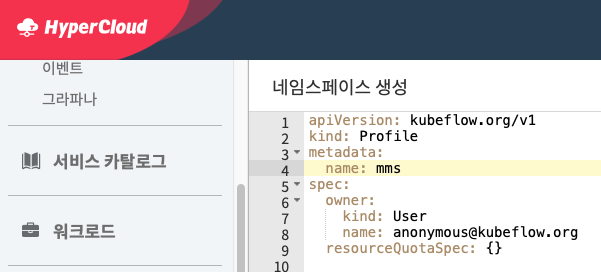

```bash
kubectl apply -f 0.profile.yaml
```

- 본 시나리오의 작업을 위해 model-pvc(readWriteMany)를 생성

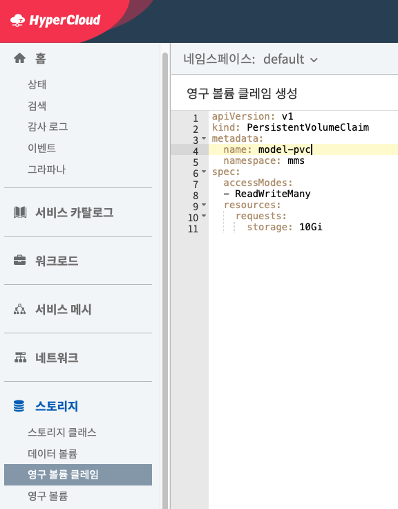

- 참고: [0.pvc.yaml](0.pvc.yaml)


# Step 1. ML 코드 작성을 위한 notebook 만들기

- hyperflow에서 ML 코드 작성을 위한 JupyerNotebook 생성

- 이전 단계에서 생성한 model-pvc를 마운트하는 model-notebook을 생성

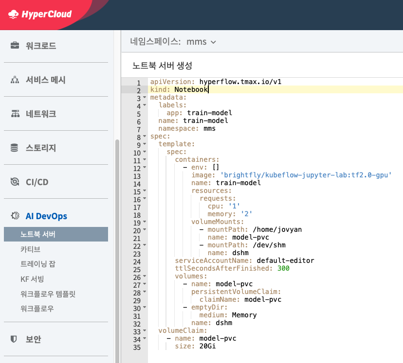

- 참고: [1.notebook.yaml](1.notebook.yaml)

- 본 시나리오에서는 TensorFlow만을 사용하여 TensorFlow를 지원하는 JupyterNotebook를 사용함

- 배포가 정상적으로 되었으면 action->connect를 눌러 jupyter 진입

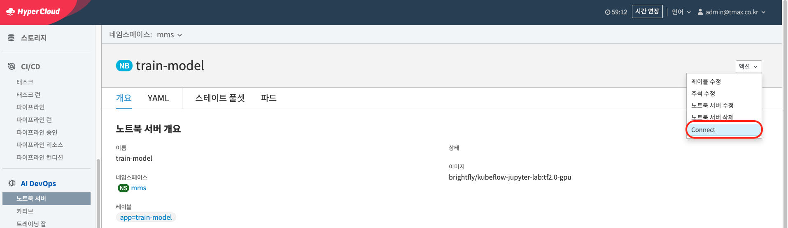


# Step 2. ML model을 코딩하고, InferenceService에서 사용할 checkpoint 생성하기

- TensorFlow를 활용하여 ML 코드를 작성하고 학습을 진행

- 학습한 model의 checkpoint를 저장함

- [2.fashion.ipynb](2.fashion.ipynb)와 [2.mnist.ipynb](2.mnist.ipynb)를 참고하여 model 코드 작성하고 학습을 진행함

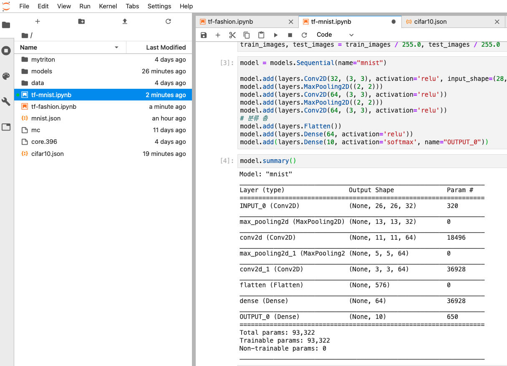

- 본 시나리오는 Triton에서auto-generated model configuration을 지원하는 TensorFlow의savedmodel 방식을 사용함


# Step 3. InferenceService에서 model을 로딩할 수 있도록 minio 관련 설정 세팅

- 현재 kfserving의 `agent`에서는 `StorageUri`로 `gs:`, `s3:` 프로토콜만을 지원하여 S3 호환성를 가진 minio storage server를 사용하여 진행 (pvc 지원 X)

- 본 시나리오에서는 kubeflow에서 사용하는 mino storage server를 이용하여 진행

- master node에서 kubeflow에서 사용하는 minio storage server의 `MINIO_SECRET_KEY`와 `MINIO_ACCESS_KEY` 확인

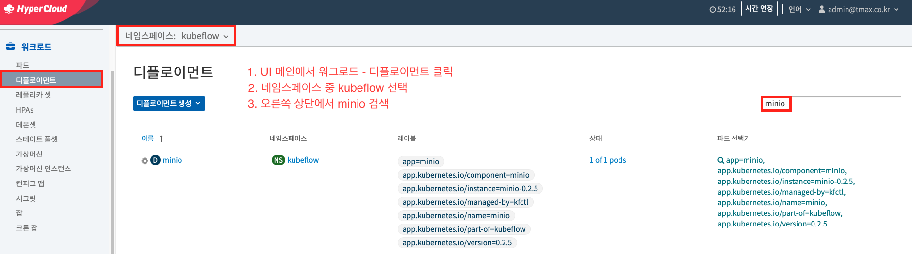

- master node에서 minio service 확인

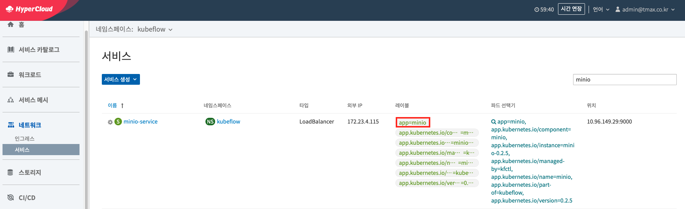


- InferenceService의 `agent`에서 minio의 s3 endpoint에 접근할 수 있도록 설정
    - 만약 이전 단계에서의 minio의 `MINIO_ACCESS_KEY` 또는 `MINIO_SECRET_KEY`가 다른 경우 변경해서 적용 (BASE64 암호 사용)


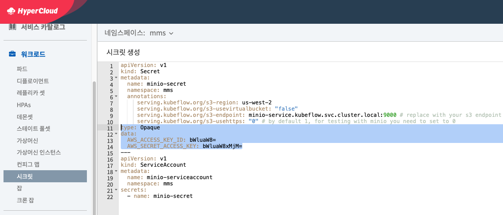


- 본 시나리오에서는 mms라는 namespace에서 진행하기 때문에 kubeflow namespace의 minio-service와 연결이 필요

    - 방법 1) service DNS의 full name을 `s3_secret`에 작성 후 secret 생성
    ([3.s3_secret.yaml](3.s3_secret.yaml) 9번째 line 참고)

    - 방법 2) `ExternalName`를 통해 kubeflow namespace에 존재하는 minio-service 연결

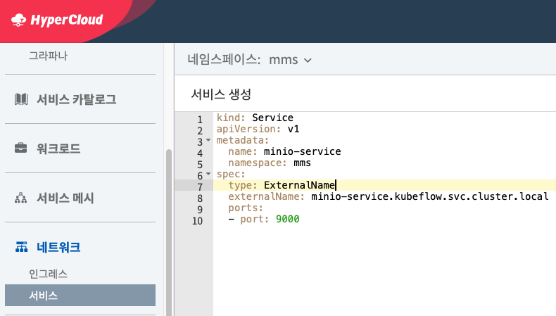


# Step 4. InferenceService 생성하기

- 이 단계에서는 UI 에러로 인해 master node에서 직접 작업함

- Multi Model Serving을 위한 InferenceService (inferenceserver) 생성
    - 기존의 InferenceService와 다르게 `StorageUri`를 제외하고 생성
    - s3 endpoint를 위한 serviceaccount 연결

```bash
kubectl apply -f 4.inferenceserver.yaml
```

- 참고 [4.inferenceserver.yaml](4.inferenceserver.yaml)


- InferenceService가 정상적으로 생성 되었는지 확인
    - 아래의 결과처럼 `READY`가 True이면 정상

```bash
kubectl get inferenceservice triton-mms -n mms

NAME   URL                                                    READY   AGE
triton-mms   http://triton-mms.default.35.229.120.99.xip.io   True    8h
```


# Step 5. 학습한 model들을 InferenceService에 로딩하기

## minio client를 통한 minio storage server로 업로드

- 이전 단계에서 만든 checkpoint를 InferenceService에서 로딩할 수 있게하려면 minio storage server로 업로드를 해야함

- minio client를 통해서 checkpoint를 업로드

- minio client를 사용하기 위해 JupyterNoteBook에서 터미널을 열어 다음 명령어를 입력

```bash
wget https://dl.min.io/client/mc/release/linux-amd64/mc
chmod +x mc
```

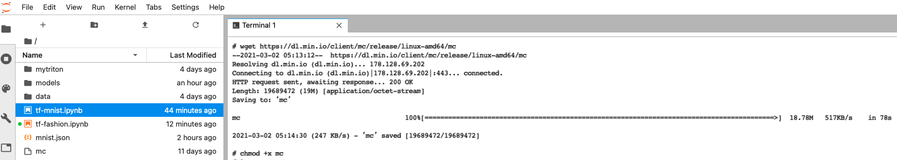

- minio storage server 접근을 위해 minio pod IP와 port를 알아야함

- UI 환경에서 확인

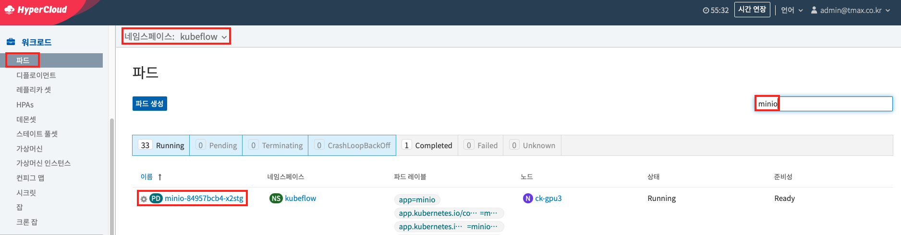


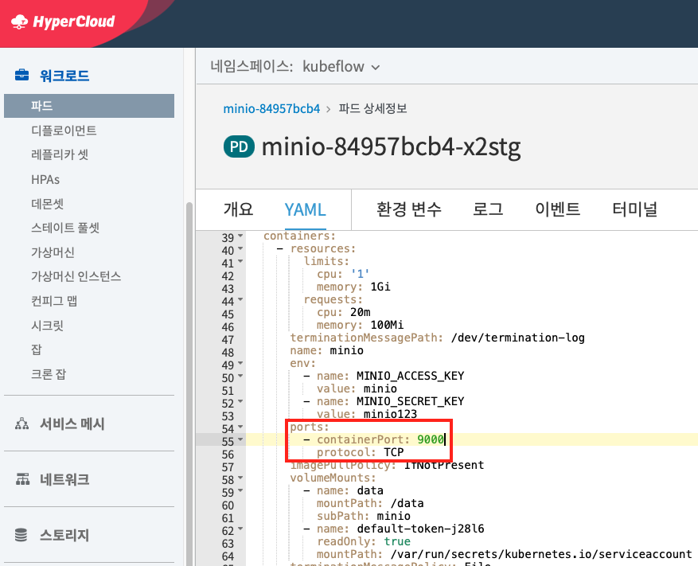


- minio client 다운로드 받은 경로에서 위의 명령어에서 출력된 IP, port를 사용하여 kubeflow의 minio server 접근
    - access key와 secret key는 이전 단계에서 확인 했던 것을 사용

```bash
./mc config host add myminio http://${MINIO_IP}:${MINIO_PORT} ${MINIO_ACCESS_KEY} ${MINIO_SECRET_KRY}
```

- 해당 minio server에서 bucket을 만들고 checkpoint 업로드

```bash
# bucket 생성
./mc mb myminio/triton
# 업로드
./mc cp -r models/ myminio/triton/models
```

- 제대로 업로드 되었는지 확인

```bash
./mc tree myminio/
```

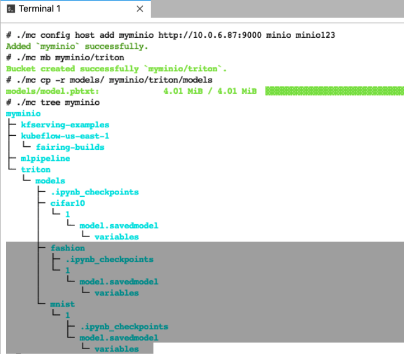


## `TrainedModel` 생성하기

- InfereneceService에서는 model을 `TrainedModel`이라는 CRD를 통해서 관리함

- 이전 단계에서 만든 model을 통한 InferenceService를 제공할 `TrainedModel` 생성

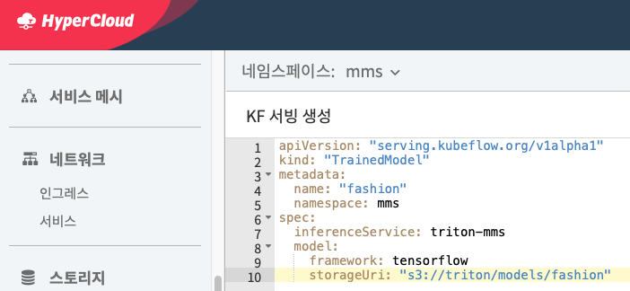

- [5.fashion.yaml](5.fashion.yaml), [5.mnist.yaml](5.mnist.yaml) 참고


- UI 에러로 인해 master node에서 `agent`가 정상적으로 모델을 다운로드하였는지 확인
```bash
SERVER=$(k get pod -l serving.kubeflow.org/inferenceservice=triton-mms -o name -n mms)
kubectl -n mms logs $SERVER agent


{"level":"info","ts":"2021-03-02T06:02:23.468Z","caller":"agent/watcher.go:103","msg":"Processing event \"/mnt/configs/..data\": CREATE"}
{"level":"info","ts":"2021-03-02T06:02:23.469Z","caller":"agent/watcher.go:173","msg":"adding model mnist"}
{"level":"info","ts":"2021-03-02T06:02:23.469Z","caller":"agent/puller.go:121","msg":"Worker is started for mnist"}
{"level":"info","ts":"2021-03-02T06:02:23.469Z","caller":"agent/puller.go:129","msg":"Downloading model from s3://triton/models/mnist"}
{"level":"info","ts":"2021-03-02T06:02:23.469Z","caller":"agent/downloader.go:47","msg":"Downloading s3://triton/models/mnist to model dir /mnt/models"}
{"level":"info","ts":"2021-03-02T06:02:23.610Z","caller":"agent/downloader.go:67","msg":"Creating successFile /mnt/models/mnist/SUCCESS.8b34ed0e1c8fb61008fe05590f36cd939ba74d0770df3ed1c9fcc235b3d4e5d1"}
{"level":"info","ts":"2021-03-02T06:02:25.237Z","caller":"agent/puller.go:146","msg":"Successfully loaded model mnist"}
{"level":"info","ts":"2021-03-02T06:02:25.237Z","caller":"agent/puller.go:114","msg":"completion event for model mnist, in flight ops 0"}
```

- InferenceService에서도 memory에 로드했는지 확인 (master node에서 확인)

```bash
kubectl logs $SERVER kfserving-container


~~~~
{
    "name": "mnist",
    "platform": "tensorflow_savedmodel",
    "backend": "tensorflow",
    "version_policy": {
        "latest": {
            "num_versions": 1
        }
    },
    "max_batch_size": 1,
    "input": [
        {
            "name": "INPUT_0_input",
            "data_type": "TYPE_FP32",
            "dims": [
                28,
                28,
                1
            ]
        }
    ],
    "output": [
        {
            "name": "OUTPUT_0",
            "data_type": "TYPE_FP32",
            "dims": [
                10
            ]
        }
    ],
    "optimization": {
        "priority": "PRIORITY_DEFAULT",
        "input_pinned_memory": {
            "enable": true
        },
        "output_pinned_memory": {
            "enable": true
        }
    },
    "instance_group": [
        {
            "name": "mnist",
            "kind": "KIND_GPU",
            "count": 1,
            "gpus": [
                0
            ],
            "profile": []
        }
    ],
    "default_model_filename": "model.savedmodel",
    "cc_model_filenames": {},
    "metric_tags": {},
    "parameters": {},
    "model_warmup": []
}
~~~
```


# Step 6. 학습한 model들을 이용한 inference 테스트

- InferenceService로 request를 위한 환경 변수 설정 (master node에서 진행)

```bash
# INGRESS에서 인식할 수 있도록 SERVICE_HOSTNAME 설정
SERVICE_HOSTNAME=$(kubectl get inferenceservices triton-mms -o jsonpath='{.status.url}' -n mms | cut -d "/" -f 3)
CLUSTER_IP=$(kubectl -n istio-system get service kfserving-ingressgateway -o jsonpath='{.status.loadBalancer.ingress[0].ip}')
```

- Request가 정상적으로 가는지 확인
    - 정상적으로 가지 않거나 다음과 같이 서버의 metadata가 나오지 않는다면 InferenceService pod의 `ClusterIP` 또는  service를 통해서 expose해서 해당 url을 사용해야함 (endpoint는 동일)

```bash
curl -v -H "Host: ${SERVICE_HOSTNAME}" http://${CLUSTER_IP}/v2

{"name":"triton","version":"2.2.0","extensions":["classification","sequence","model_repository","schedule_policy","model_configuration","system_shared_memory","cuda_shared_memory","binary_tensor_data","statistics"]}
```


- 모델 endpoint로 inference 요청

```bash
MODEL_NAME=mnist
curl -v -X POST -H "Host: ${SERVICE_HOSTNAME}" http://${CLUSTER_IP}/v2/models/$MODEL_NAME/infer -d @./${MODEL_NAME}.json


{"model_name":"mnist","model_version":"1","outputs":[{"name":"OUTPUT_0","datatype":"FP32","shape":[1,10],"data":[5.710052656399123e-13,1.599723731260383e-8,3.309397755835164e-10,1.5357866800513876e-7,3.9533000517621988e-7,2.6684685017208667e-10,8.332194661878414e-14,0.9999977350234985,1.66733338247127e-9,0.0000017882068732433254]}]}
```

- 두 개 모델에 대해서 inference가 가능하다면 Multi Model Serving이 된 것이다.
